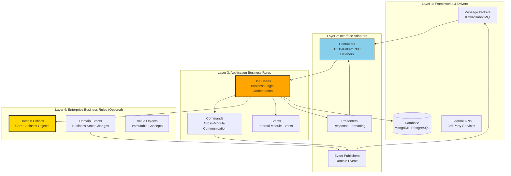
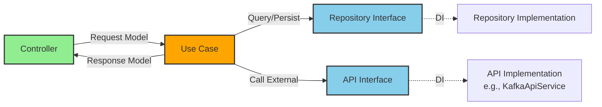
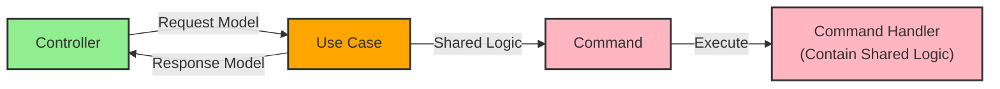
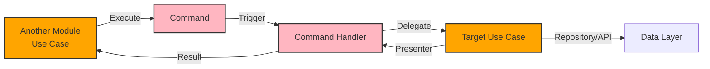
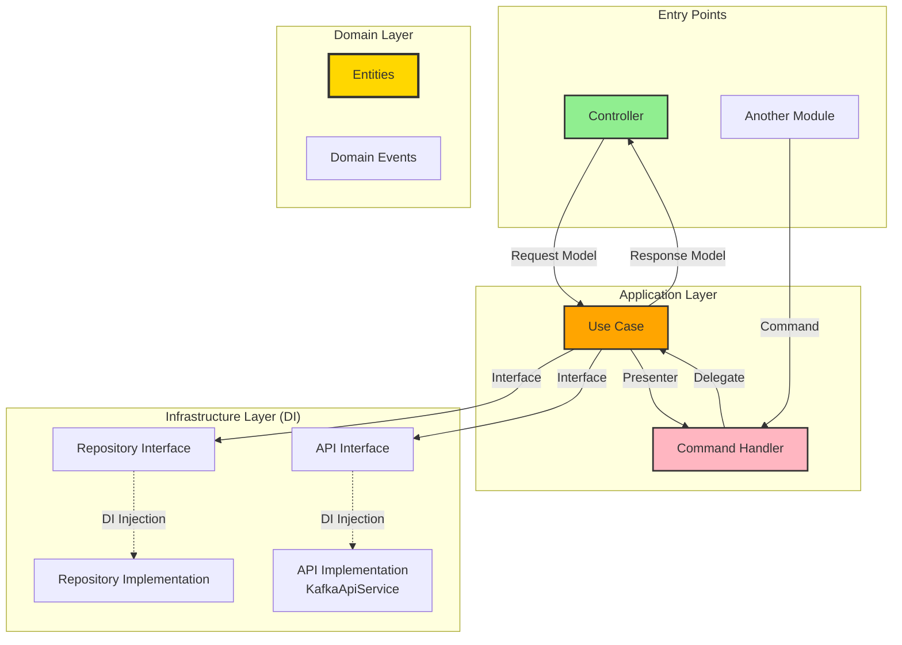

# Application Design Guide

**Version:** 1.6
**Last Updated:** 2025-12-25

---

## Table of Contents

1. [Clean Architecture + Modular Principle](#1-clean-architecture--modular-principle)
2. [Project Structure](#2-project-structure)
3. [Terminology & Concepts](#3-terminology--concepts)
4. [Framework Guidelines](#4-framework-guidelines)
5. [Common Commands](#5-common-commands)
6. [Testing](#6-testing)
7. [Best Practices](#7-best-practices)
8. [References](#8-references)

---

## 1. Clean Architecture + Modular Principle

We apply Clean Architecture and the Modular principle to ensure the project is maintainable, testable, and has a longer lifespan.

**References:**

- Clean Architecture: <https://blog.cleancoder.com/uncle-bob/2012/08/13/the-clean-architecture.html>
- Modular Programming: <https://en.wikipedia.org/wiki/Modular_programming>

### 1.1 Architecture Layers



### 1.2 Common Request Flows

#### Flow 1: Controller → Use Case → Repository/API



**Use Case Returns:** Response Model (for Controllers)

#### Flow 2: Controller → Use Case → Command (Shared Logic)



**Use Case Returns:** Response Model (for Controllers)

#### Flow 3: Another Module → Command → Use Case



**Use Case Returns:** Presenter (for Commands/Cross-Module Communication)

### 1.3 Dependency Flow Summary



### 1.4 Mapping Concepts with NestJS

| Clean Architecture Layer | NestJS Component | Location |
|--------------------------|------------------|----------|
| **Entities Layer** | Domain entities, Value Objects | `src/shared/domain/entities/` |
| **Use Cases Layer** | Use case classes (business logic) | `src/modules/{module}/usecases/` |
| **Controllers Layer** | HTTP/Kafka/gRPC listeners | `src/modules/{module}/{module}.controller.ts` |
| **Presenters Layer** | Response formatters | `src/modules/{module}/models/presenters/` |
| **Commands Layer** | CQRS commands & handlers | `src/modules/{module}/commands/` |
| **Events Layer** | Domain events | `src/shared/common/models/seedwork/domain-event.ts` |
| **Repository Interfaces** | Data access contracts | `src/shared/domain/repositories/` |
| **Repository Implementations** | Database-specific repositories | `src/shared/mongo/repositories/`, `src/shared/postgres/repositories/` |
| **API Interfaces** | External service contracts | `src/shared/domain/apis/` |
| **API Implementations** | External service clients | `src/shared/api/impl/` (e.g., `kafka-api.service.ts`) |

### 1.5 Use Case Return Type Pattern

**Critical Pattern:**

| HTTP Method | Use Case Returns | Purpose |
|-------------|------------------|---------|
| **GET** | Presenter | Data transformation for read operations |
| **POST/PUT/DELETE** | Response Model | Formatted response for mutation operations |
| **Command Handler** | Presenter | Data transformation for cross-module communication |

**IMPORTANT:** Use Cases NEVER return raw Entities. Always convert to Presenter or Response Model.

**Presenter Pattern (for GET APIs and Cross-Module):**

```typescript
// Presenter - transforms Entity for output
// Location: src/modules/order/models/presenters/order.presenter.ts
export class OrderPresenter {
  id: string;
  status: string;
  totalAmount: number;
  customerName: string;
  createdAt: Date;

  constructor(order: Order) {
    this.id = order.id;
    this.status = order.status;
    this.totalAmount = order.totalAmount;
    this.customerName = order.customer?.name; // Can transform/flatten nested data
    this.createdAt = order.createdAt;
  }
}

// Use Case returning Presenter (for GET)
@Injectable()
export class GetOrderUseCase {
  async execute(id: string): Promise<OrderPresenter> {
    const order = await this.orderRepository.findById(id);
    if (!order) throw new NotFoundException();
    return new OrderPresenter(order); // ✅ Presenter, NOT Entity
  }
}

// Controller wraps Presenter in HttpApiResponse
@Get(':id')
async getOrder(@Param('id') id: string): Promise<HttpApiResponse<OrderPresenter>> {
  const presenter = await this.getOrderUseCase.execute(id);
  return HttpApiResponse.success(presenter);
}
```

**Response Model Pattern (for POST/PUT/DELETE APIs):**

```typescript
// Response Model - formatted response for mutations
// Location: src/modules/order/models/responses/create-order.response.ts
export class CreateOrderResponse {
  id: string;
  status: string;
  message: string;

  constructor(order: Order) {
    this.id = order.id;
    this.status = order.status;
    this.message = 'Order created successfully';
  }
}

// Use Case returning Response Model (for POST)
@Injectable()
export class CreateOrderUseCase {
  async execute(request: CreateOrderRequest): Promise<CreateOrderResponse> {
    const order = await this.orderRepository.save(new Order(request));
    return new CreateOrderResponse(order); // ✅ Response Model for mutations
  }
}

// Controller wraps Response Model in HttpApiResponse
@Post()
async createOrder(@Body() request: CreateOrderRequest): Promise<HttpApiResponse<CreateOrderResponse>> {
  const response = await this.createOrderUseCase.execute(request);
  return HttpApiResponse.success(response);
}
```

**Summary:**
| Operation | Use Case Returns | Location |
|-----------|------------------|----------|
| GET (single) | `OrderPresenter` | `models/presenters/` |
| GET (list) | `PaginatedOrdersPresenter` | `models/presenters/` |
| POST | `CreateOrderResponse` | `models/responses/` |
| PUT | `UpdateOrderResponse` | `models/responses/` |
| DELETE | `void` or `DeleteOrderResponse` | `models/responses/` |

### 1.6 Repository and API Dependency Injection Pattern

**Pattern:** Use Cases depend on INTERFACES, not implementations. Implementations are injected via NestJS DI.

**CRITICAL:** All framework-specific setup (schemas, repository DI wiring) belongs in infrastructure modules (`postgres.module.ts`, `mongo.module.ts`), NOT in business modules.

#### Repository Pattern

```typescript
// 1. Define Interface (Domain Layer)
// Location: src/shared/domain/repositories/order.repository.interface.ts
export const ORDER_REPOSITORY = Symbol('ORDER_REPOSITORY');

export interface OrderRepository {
  findById(id: string): Promise<Order | null>;
  save(order: Order): Promise<Order>;
}

// 2. Implement Repository (Infrastructure Layer)
// Location: src/shared/postgres/repository/order.repository.impl.ts
@Injectable()
export class OrderRepositoryImpl implements OrderRepository { /* ... */ }

// 3. Wire in Infrastructure Module (postgres.module.ts)
@Global()
@Module({
  imports: [TypeOrmModule.forFeature([OrderSchema], DBConnections.INTERNAL)],
  providers: [{ provide: ORDER_REPOSITORY, useClass: OrderRepositoryImpl }],
  exports: [ORDER_REPOSITORY],
})
export class PostgresModule {}

// 4. Business Module - NO framework imports
@Module({
  controllers: [OrderController],
  providers: [...UseCases], // Only business logic
})
export class OrderModule {}
```

#### API Pattern (External Services)

```typescript
// 1. Define Interface (Domain Layer)
export const KAFKA_API = Symbol('KAFKA_API');
export interface KafkaApi { publish(topic: string, message: any): Promise<void>; }

// 2. Implement (Infrastructure Layer)
@Injectable()
export class KafkaApiService implements KafkaApi { /* ... */ }

// 3. Wire in Infrastructure Module (api.module.ts)
@Global()
@Module({
  providers: [{ provide: KAFKA_API, useClass: KafkaApiService }],
  exports: [KAFKA_API],
})
export class ApiModule {}
```

**Benefits:**

- ✅ Testability: Easy to mock interfaces
- ✅ Flexibility: Swap implementations without changing use cases
- ✅ Clean Architecture: Business modules framework-agnostic

### 1.7 Dependency Direction Rules

**Critical Rules:**

1. **Domain Layer (Pure Business Logic)**
   - Location: `src/shared/domain/entities/`
   - MUST NOT depend on database libraries (TypeORM, Mongoose)
   - MUST NOT depend on framework libraries (NestJS, Express)
   - MUST NOT depend on external API implementations
   - Can only depend on plain TypeScript/JavaScript

2. **Use Cases Layer (Application Business Logic)**
   - Location: `src/modules/{module}/usecases/`
   - MUST NOT depend on database libraries
   - MUST NOT depend on HTTP/message broker libraries
   - MUST NOT depend on repository implementations
   - MUST NOT depend on external API implementations
   - MUST NOT depend on controllers
   - CAN depend on domain entities and repository interfaces
   - CAN depend on command bus for cross-module communication
   - CAN publish domain events for internal/external notifications

3. **Commands Layer (Cross-Module Communication)**
   - Location: `src/modules/{module}/commands/`
   - Commands are at the SAME LAYER as use cases
   - Used for cross-module business logic communication
   - Used to share logic between multiple use cases
   - CAN depend on domain entities and repository interfaces
   - CAN publish domain events

4. **Controllers Layer (Interface Adapters)**
   - CAN depend on use cases
   - MUST NOT depend on repository implementations
   - MUST NOT depend on database libraries directly

5. **Dependency Injection**
   - Real dependencies are wired in `*.module.ts` files

---

## 2. Project Structure

### 2.1 Complete Structure

```
src/                              ─────────► Main source folder
├── modules/                      ─────────► Business modules (domain-specific logic)
│   └── {module-name}/            ─────────► Business module (e.g., user, order, payment)
│       ├── usecases/             ─────────► Use cases (business logic orchestration)
│       ├── commands/             ─────────► Commands for cross-module communication
│       │   └── handlers/         ─────────► Command handlers
│       ├── events/               ─────────► Normal events (internal module communication)
│       │   └── handlers/         ─────────► Event handlers
│       ├── models/               ─────────► Models (NOT dto)
│       │   ├── requests/         ─────────► Request models (input validation)
│       │   ├── responses/        ─────────► Response models (output formatting)
│       │   └── presenters/       ─────────► Presenters (response transformation)
│       ├── {module}.controller.ts         ─────────► HTTP/Kafka/gRPC controllers
│       ├── {module}.controller.spec.ts    ─────────► Controller tests
│       └── {module}.module.ts             ─────────► NestJS module definition
│
├── shared/                       ─────────► Shared modules folder
│   ├── domain/                   ─────────► Shared domain layer (core business concepts)
│   │   ├── entities/             ─────────► Shared entities (cross-module business objects)
│   │   ├── repositories/         ─────────► Repository interfaces (data access contracts)
│   │   ├── apis/                 ─────────► External API service interfaces
│   │   ├── types/                ─────────► Domain types and value objects
│   │   ├── enums/                ─────────► Domain enumerations
│   │   └── constants/            ─────────► Domain constants
│   │
│   ├── common/                   ─────────► Common utilities
│   │   ├── models/               ─────────► Shared models
│   │   │   └── seedwork/         ─────────► Base classes
│   │   │       └── domain-event.ts        ─────────► Domain event base class
│   │   ├── utils/                ─────────► Utility functions
│   │   └── filters/              ─────────► Exception filters
│   │       └── exception.filter.ts
│   │
│   ├── config/                   ─────────► Configuration module
│   │   ├── config.module.ts      ─────────► Config module (global)
│   │   ├── config.service.ts     ─────────► Config service with typed getters
│   │   └── config.schema.ts      ─────────► Environment validation schema (Joi)
│   │
│   ├── event/                    ─────────► Event handling infrastructure
│   │   ├── event.module.ts       ─────────► Event module (auto-publishes domain events)
│   │   └── listeners/            ─────────► Shared event listeners
│   │       └── domain.event-handler.ts    ─────────► Auto Kafka publisher for domain events
│   │
│   ├── api/                      ─────────► External API implementations
│   │   ├── api.module.ts
│   │   └── impl/                 ─────────► API client implementations
│   │
│   ├── health/                   ─────────► Health check infrastructure
│   │   ├── health.controller.ts
│   │   ├── health.controller.spec.ts
│   │   ├── health.module.ts
│   │   └── indicators/           ─────────► Custom health indicators
│   │
│   ├── logger/                   ─────────► Logging infrastructure
│   │   ├── decorators/           ─────────► Logger decorators
│   │   ├── interceptors/         ─────────► Request/response interceptors
│   │   ├── logger.module.ts
│   │   ├── model/                ─────────► Logger models
│   │   ├── services/             ─────────► Logger services
│   │   └── utils/                ─────────► Logger utilities
│   │
│   ├── mongo/                    ─────────► MongoDB infrastructure
│   │   ├── mongo.module.ts
│   │   ├── repositories/         ─────────► MongoDB repository implementations
│   │   └── schemas/              ─────────► Mongoose schemas
│   │
│   └── postgres/                 ─────────► PostgreSQL infrastructure
│       ├── postgres.module.ts
│       ├── cache/                ─────────► Query caching
│       ├── repositories/         ─────────► PostgreSQL repository implementations
│       ├── schemas/              ─────────► TypeORM entities
│       ├── migration/            ─────────► Database migrations
│       └── utils/                ─────────► Database utilities
│
├── utils/                        ─────────► Application-level utilities
│   ├── api.response.ts           ─────────► Generic API responses
│   ├── constants.ts              ─────────► Application constants
│   ├── error.code.ts             ─────────► Error code definitions
│   ├── exception.utils.ts        ─────────► Exception utilities
│   ├── safe-command.handler.ts   ─────────► CQRS command handler wrapper
│   ├── safe-event.handler.ts     ─────────► Event handler wrapper
│   ├── string.utils.ts           ─────────► String utilities
│   └── type.utils.ts             ─────────► Type utilities
│
├── app.module.ts                 ─────────► Root application module
├── main.ts                       ─────────► Application entry point
└── telemetry.ts                  ─────────► OpenTelemetry setup

test/                             ─────────► E2E testing folder
├── jest-e2e.json                 ─────────► Jest E2E configuration
└── {feature}.e2e-spec.ts         ─────────► E2E test files
```

### 2.2 When to Create New Components

#### Create New Business Module

**When:** Adding a new business capability or domain concept

**Steps:**

```bash
# 1. Create module structure
nest g module modules/{module-name}

# 2. Create controller
nest g controller modules/{module-name}
```

**Then manually create:**

```
src/modules/{module-name}/
├── usecases/                     # Business logic
├── commands/                     # Cross-module commands
│   └── handlers/
├── events/                       # Module events
│   └── handlers/
├── models/                       # Models (NOT dto)
│   ├── requests/                 # Request models
│   ├── responses/                # Response models
│   └── presenters/               # Presenters
├── {module-name}.controller.ts
├── {module-name}.controller.spec.ts
└── {module-name}.module.ts
```

#### Create New Use Case

**When:** Adding a new business operation within a module

**Purpose:** Orchestrate business logic, coordinate between domain entities, repositories, and commands

**Location:** `src/modules/{module}/usecases/{action}.usecase.ts`

**Example:**

```typescript
import { Injectable } from '@nestjs/common';
import { CommandBus } from '@nestjs/cqrs';

@Injectable()
export class ProcessOrderUseCase {
  constructor(
    private readonly orderRepository: OrderRepository,
    private readonly commandBus: CommandBus,
  ) {}

  async execute(input: ProcessOrderRequest): Promise<ProcessOrderResponse> {
    // 1. Load domain entity
    const order = await this.orderRepository.findById(input.orderId);

    // 2. Execute business logic
    order.process();

    // 3. Persist changes
    await this.orderRepository.save(order);

    // 4. Trigger cross-module logic via command
    await this.commandBus.execute(
      new NotifyCustomerCommand(order.customerId, order.id),
    );

    // 5. Return response
    return new ProcessOrderResponse(order);
  }
}
```

**Register in module:**

```typescript
@Module({
  providers: [ProcessOrderUseCase],
})
export class OrderModule {}
```

#### Create New Command (Cross-Module Communication)

**When:**

1. Communicating between different business modules
2. Sharing logic between multiple use cases
3. Executing operations that span multiple bounded contexts

**Purpose:** Commands are at the SAME LAYER as use cases, used for cross-module business logic

**Location:**

- Command: `src/modules/{module}/commands/{action}.command.ts`
- Handler: `src/modules/{module}/commands/handlers/{action}.handler.ts`

**Example:**

```typescript
// Command (cross-module intent)
export class NotifyCustomerCommand {
  constructor(
    public readonly customerId: string,
    public readonly orderId: string,
  ) {}
}

// Handler (executes cross-module logic)
import { CommandHandler, ICommandHandler } from '@nestjs/cqrs';

@CommandHandler(NotifyCustomerCommand)
export class NotifyCustomerHandler implements ICommandHandler<NotifyCustomerCommand> {
  constructor(
    private readonly customerRepository: CustomerRepository,
    private readonly notificationService: NotificationService,
  ) {}

  async execute(command: NotifyCustomerCommand): Promise<void> {
    const customer = await this.customerRepository.findById(command.customerId);
    await this.notificationService.send(customer.email, {
      orderId: command.orderId,
    });
  }
}
```

**Register in module:**

```typescript
@Module({
  providers: [NotifyCustomerHandler],
})
export class NotificationModule {}
```

#### Create Normal Event (Internal Module Communication)

**When:** Publishing events within a module or across modules (in-process)

**Purpose:** Decouple components within or across modules using event-driven architecture

**Location:**

- Event: `src/modules/{module}/events/{event-name}.event.ts`
- Handler: `src/modules/{module}/events/handlers/{event-name}.handler.ts`

**Example:**

```typescript
// Event
export class OrderCreatedEvent {
  constructor(
    public readonly orderId: string,
    public readonly customerId: string,
  ) {}
}

// Handler
import { EventsHandler, IEventHandler } from '@nestjs/cqrs';

@EventsHandler(OrderCreatedEvent)
export class OrderCreatedHandler implements IEventHandler<OrderCreatedEvent> {
  async handle(event: OrderCreatedEvent) {
    // Handle event logic (in-process)
  }
}
```

**Publish from use case:**

```typescript
import { EventBus } from '@nestjs/cqrs';

export class CreateOrderUseCase {
  constructor(private readonly eventBus: EventBus) {}

  async execute(input: CreateOrderRequest) {
    // Business logic...

    // Publish event
    this.eventBus.publish(new OrderCreatedEvent(order.id, order.customerId));
  }
}
```

#### Create Domain Event (External & Internal Publishing)

**When:**

1. Publishing business state changes to external systems (Kafka, RabbitMQ)
2. Publishing events that need to be persisted or audited
3. Cross-service communication

**Purpose:** Domain events from `src/shared/common/models/seedwork/domain-event.ts` are automatically picked up by `src/shared/event/` module and published to Kafka

**Location:** `src/modules/{module}/events/{event-name}.domain-event.ts`

**Example:**

```typescript
import { DomainEvent } from '@/shared/common/models/seedwork/domain-event';
import { v4 as uuidv4 } from 'uuid';

export class OrderProcessedDomainEvent extends DomainEvent<OrderProcessedPayload> {
  constructor(payload: OrderProcessedPayload) {
    super({
      id: uuidv4(),
      refId: payload.orderId,
      timestamp: new Date(),
      actor: { name: 'order-service' },
      source: { module: 'order' },
    });
    this.payload = payload;
  }

  get code(): string {
    return 'order.processed';
  }

  key(): string {
    return this.payload.orderId;
  }
}

interface OrderProcessedPayload {
  orderId: string;
  customerId: string;
  totalAmount: number;
}
```

**Publish from use case:**

```typescript
import { EventBus } from '@nestjs/cqrs';

export class ProcessOrderUseCase {
  constructor(private readonly eventBus: EventBus) {}

  async execute(input: ProcessOrderRequest) {
    // Business logic...

    // Publish domain event (auto-sent to Kafka by shared/event module)
    this.eventBus.publish(
      new OrderProcessedDomainEvent({
        orderId: order.id,
        customerId: order.customerId,
        totalAmount: order.total,
      }),
    );
  }
}
```

**How it works:**

1. Use case publishes `DomainEvent` via `EventBus`
2. `src/shared/event/listeners/domain.event-handler.ts` automatically intercepts ALL domain events
3. Domain events are serialized and published to Kafka topic
4. External services can subscribe to these Kafka events

#### Create Request/Response Models

**When:** Defining input/output contracts for controllers and use cases

**Location:**

- Request: `src/modules/{module}/models/requests/{name}.request.ts`
- Response: `src/modules/{module}/models/responses/{name}.response.ts`

**Example Request:**

```typescript
import { IsString, IsNotEmpty, IsNumber } from 'class-validator';

export class CreateOrderRequest {
  @IsString()
  @IsNotEmpty()
  customerId: string;

  @IsNumber()
  @IsNotEmpty()
  totalAmount: number;
}
```

**Example Response:**

```typescript
export class CreateOrderResponse {
  orderId: string;
  status: string;
  createdAt: Date;

  constructor(order: Order) {
    this.orderId = order.id;
    this.status = order.status;
    this.createdAt = order.createdAt;
  }
}
```

#### Create Presenter

**When:** Complex response transformation logic

**Location:** `src/modules/{module}/models/presenters/{name}.presenter.ts`

**Example:**

```typescript
import { Injectable } from '@nestjs/common';

@Injectable()
export class OrderPresenter {
  present(order: Order): OrderDetailResponse {
    return {
      id: order.id,
      customer: {
        id: order.customer.id,
        name: order.customer.name,
      },
      items: order.items.map(item => ({
        productId: item.productId,
        quantity: item.quantity,
        price: this.formatPrice(item.price),
      })),
      total: this.formatPrice(order.total),
    };
  }

  private formatPrice(amount: number): string {
    return `$${amount.toFixed(2)}`;
  }
}
```

#### Create Shared Entity

**When:** Creating a core business object used across multiple modules

**Location:** `src/shared/domain/entities/{entity-name}.ts`

**Example:**

```typescript
export class Customer {
  constructor(
    public readonly id: string,
    public readonly email: string,
    public readonly name: string,
  ) {}

  updateEmail(newEmail: string): void {
    // Validation logic
    this.email = newEmail;
  }
}
```

#### Create Repository Interface

**When:** Adding a new data access requirement

**Location:** `src/shared/domain/repositories/{entity}.repository.interface.ts`

**Example:**

```typescript
export interface CustomerRepository {
  findById(id: string): Promise<Customer | null>;
  findByEmail(email: string): Promise<Customer | null>;
  save(customer: Customer): Promise<Customer>;
  delete(id: string): Promise<void>;
}
```

#### Create Repository Implementation

**For MongoDB:** `src/shared/mongo/repositories/{entity}.repository.ts`

**For PostgreSQL:** `src/shared/postgres/repositories/{entity}.repository.ts`

**Example (MongoDB):**

```typescript
import { Injectable } from '@nestjs/common';
import { InjectModel } from '@nestjs/mongoose';
import { Model } from 'mongoose';

@Injectable()
export class CustomerRepositoryImpl implements CustomerRepository {
  constructor(
    @InjectModel(Customer.name)
    private readonly customerModel: Model<CustomerDocument>,
  ) {}

  async findById(id: string): Promise<Customer | null> {
    return this.customerModel.findById(id).exec();
  }

  async save(customer: Customer): Promise<Customer> {
    return this.customerModel.create(customer);
  }
}
```

---

## 3. Terminology & Concepts

### 3.1 Core Architectural Concepts

| Term | Layer | Definition | When to Use | Location |
|------|-------|------------|-------------|----------|
| **Module** | N/A | Self-contained business capability | Group related business logic | `src/modules/{module}/` |
| **Entity** | Domain | Business object with identity | Core business concepts shared across modules | `src/shared/domain/entities/` |
| **Value Object** | Domain | Immutable descriptive object without identity | Descriptive concepts (address, money, etc.) | `src/shared/domain/types/` |
| **Use Case** | Application | Orchestrates business operations | Implement specific business workflows | `src/modules/{module}/usecases/` |
| **Command** | Application (same as use case) | Intent for cross-module communication | Cross-module logic, shared logic between use cases | `src/modules/{module}/commands/` |
| **Command Handler** | Application | Executes commands | Handle cross-module operations | `src/modules/{module}/commands/handlers/` |
| **Event** | Application | In-process notification | Decouple components within/across modules | `src/modules/{module}/events/` |
| **Domain Event** | Domain | Business state change for internal & external systems | Publish to Kafka, cross-service communication | Extends `src/shared/common/models/seedwork/domain-event.ts` |
| **Request Model** | Interface | Input data with validation | Controller input, use case parameters | `src/modules/{module}/models/requests/` |
| **Response Model** | Interface | Output data structure | Controller response, use case return | `src/modules/{module}/models/responses/` |
| **Presenter** | Interface | Response transformation logic | Complex response formatting | `src/modules/{module}/models/presenters/` |
| **Repository Interface** | Domain | Contract for data access | Define data operations independent of storage | `src/shared/domain/repositories/` |
| **Repository Implementation** | Infrastructure | Concrete data access | Actual database operations | `src/shared/mongo/repositories/`, `src/shared/postgres/repositories/` |

### 3.2 Event Types Clarification

| Event Type | Layer | Purpose | Auto-Published to Kafka? | Location |
|------------|-------|---------|--------------------------|----------|
| **Normal Event** | Application | In-process communication within/across modules | ❌ No | `src/modules/{module}/events/` |
| **Domain Event** | Domain | Business state changes for internal & external systems | ✅ Yes (automatic) | Extends `src/shared/common/models/seedwork/domain-event.ts` |

**Key Difference:**

- **Normal Events:** Used for in-process event-driven architecture (EventBus only)
- **Domain Events:** Published to EventBus AND automatically sent to Kafka by `src/shared/event/` module

### 3.3 Command vs Use Case

| Aspect | Use Case | Command |
|--------|----------|---------|
| **Layer** | Application Business Rules | Application Business Rules (same layer) |
| **Purpose** | Orchestrate business logic within a module | Cross-module communication, shared logic |
| **Scope** | Single module operation | Cross-module operation |
| **Called By** | Controllers, Command Handlers | Use cases (via CommandBus) |
| **Can Call** | Repositories, APIs, Commands, Domain Events | Repositories, APIs, Domain Events, Other Use Cases |
| **Returns (for Controller)** | Response Model | N/A (commands called from use cases) |
| **Returns (for Command)** | Presenter | Command result / void |

### 3.4 Common Request Flow Patterns

#### Pattern 1: Controller → Use Case → [Repositories, APIs]

**Purpose:** Standard CRUD operations, simple business workflows

**Flow:**
```
HTTP Request → Controller → Use Case → Repository/API → Response Model → Controller → HTTP Response
```

**Example:**
```typescript
// Controller
@Post()
async createOrder(@Body() request: CreateOrderRequest) {
  return await this.createOrderUseCase.execute(request); // Returns Response Model
}

// Use Case
@Injectable()
export class CreateOrderUseCase {
  constructor(
    @Inject('OrderRepository') private readonly orderRepo: OrderRepository,
    @Inject('KafkaApi') private readonly kafkaApi: KafkaApi,
  ) {}

  async execute(request: CreateOrderRequest): Promise<CreateOrderResponse> {
    const order = await this.orderRepo.save(new Order(request));
    await this.kafkaApi.publish('orders', order);
    return new CreateOrderResponse(order); // Response Model for Controller
  }
}
```

#### Pattern 2: Controller → Use Case → Command (Shared Logic)

**Purpose:** Reusing logic across multiple use cases, cross-cutting concerns

**Flow:**
```
HTTP Request → Controller → Use Case → Command → Command Handler (Shared Logic) → Response Model → Controller
```

**IMPORTANT:** Shared logic is implemented DIRECTLY in the command handler, NOT in a separate use case.

**Example:**
```typescript
// Controller
@Post('process')
async processOrder(@Body() request: ProcessOrderRequest) {
  return await this.processOrderUseCase.execute(request); // Returns Response Model
}

// Use Case
@Injectable()
export class ProcessOrderUseCase {
  constructor(private readonly commandBus: CommandBus) {}

  async execute(request: ProcessOrderRequest): Promise<ProcessOrderResponse> {
    // Delegate shared logic to command
    await this.commandBus.execute(new ValidateInventoryCommand(request.items));

    // Continue with business logic
    return new ProcessOrderResponse({ status: 'processed' });
  }
}

// Command Handler - Shared logic implemented DIRECTLY here
@CommandHandler(ValidateInventoryCommand)
export class ValidateInventoryHandler {
  constructor(
    @Inject(INVENTORY_REPOSITORY)
    private readonly inventoryRepo: InventoryRepository,
  ) {}

  async execute(command: ValidateInventoryCommand): Promise<void> {
    // ✅ Shared logic implemented directly in handler
    for (const item of command.items) {
      const stock = await this.inventoryRepo.findByItemId(item.id);
      if (!stock || stock.quantity < item.quantity) {
        throw new InsufficientStockException(item.id);
      }
    }
  }
}
```

#### Pattern 3: Another Module → Command → Use Case

**Purpose:** Cross-module communication, module boundaries

**Flow:**
```
Module A Use Case → Command → Command Handler → Module B Use Case → Presenter → Command Handler → Module A
```

**Example:**
```typescript
// Module A: Order Module
@Injectable()
export class CreateOrderUseCase {
  constructor(private readonly commandBus: CommandBus) {}

  async execute(request: CreateOrderRequest): Promise<CreateOrderResponse> {
    // Cross-module communication to Inventory
    const inventoryResult = await this.commandBus.execute(
      new ReserveStockCommand(request.items)
    );

    // Use presenter data from another module
    const order = new Order(request, inventoryResult);
    return new CreateOrderResponse(order);
  }
}

// Module B: Inventory Module
@CommandHandler(ReserveStockCommand)
export class ReserveStockHandler {
  constructor(private readonly reserveStockUseCase: ReserveStockUseCase) {}

  async execute(command: ReserveStockCommand): Promise<StockPresenter> {
    // Returns Presenter (NOT Response Model) for cross-module communication
    return await this.reserveStockUseCase.execute(command.items);
  }
}

// Inventory Use Case
@Injectable()
export class ReserveStockUseCase {
  async execute(items: Item[]): Promise<StockPresenter> {
    // Business logic...
    return new StockPresenter(reservation); // Presenter for Commands
  }
}
```

**Key Differences:**

| Pattern | Entry Point | Returns | Use When |
|---------|-------------|---------|----------|
| **Pattern 1** | Controller → Use Case | Response Model | Simple operations within module |
| **Pattern 2** | Controller → Use Case → Command | Response Model | Shared logic needed across use cases |
| **Pattern 3** | Module → Command → Use Case | Presenter | Cross-module communication required |

### 3.5 Architecture Patterns

#### CQRS (Command Query Responsibility Segregation)

**Purpose:** Separate commands (write operations) from queries (read operations)

**Commands:** Cross-module operations, shared logic

**Queries:** Handled by use cases directly accessing repositories

#### Domain Event Pattern

**Purpose:** Publish business state changes to internal and external systems

**Implementation:**

1. Extend `DomainEvent` base class from `src/shared/common/models/seedwork/domain-event.ts`
2. Publish via `EventBus`
3. `src/shared/event/listeners/domain.event-handler.ts` automatically publishes to Kafka

**Auto-Publishing Mechanism:**

```typescript
// In shared/event/listeners/domain.event-handler.ts
export class DomainEventsHandler {
  onModuleInit() {
    this.eventBus
      .pipe(filter((event) => event instanceof DomainEvent))
      .subscribe((event) => {
        // Automatically publish to Kafka
        this.client.emit('domain-event-topic', event);
      });
  }
}
```

---

## 4. Framework Guidelines

### 4.1 Prerequisites

Install NestJS CLI globally:

```bash
npm install -g @nestjs/cli
```

### 4.2 Creating Components

#### Create New Business Module

```bash
nest g module modules/{module-name}
nest g controller modules/{module-name}
```

#### Create New Shared Module

```bash
nest g module shared/{module-name}
```

#### Create New Service (for use cases)

```bash
nest g service usecases/{usecase-name} modules/{module-name} --flat
```

#### Create New Filter

```bash
# Filters are in shared/common
touch src/shared/common/filters/{filter-name}.filter.ts
```

#### Create New Interceptor

```bash
nest g interceptor interceptor/{interceptor-name} shared/logger
```

### 4.3 Manual Component Creation

For use cases, commands, events, and domain objects, manual creation is recommended:

```bash
# Use case
touch src/modules/{module}/usecases/{action}.usecase.ts

# Command
touch src/modules/{module}/commands/{action}.command.ts
touch src/modules/{module}/commands/handlers/{action}.handler.ts

# Normal event
touch src/modules/{module}/events/{event}.event.ts
touch src/modules/{module}/events/handlers/{event}.handler.ts

# Domain event
touch src/modules/{module}/events/{event}.domain-event.ts

# Request/Response models
touch src/modules/{module}/models/requests/{name}.request.ts
touch src/modules/{module}/models/responses/{name}.response.ts

# Presenter
touch src/modules/{module}/models/presenters/{name}.presenter.ts

# Shared entity
touch src/shared/domain/entities/{entity}.ts

# Repository interface
touch src/shared/domain/repositories/{entity}.repository.interface.ts

# Index files (IMPORTANT - required for module registration)
touch src/modules/{module}/usecases/index.ts
touch src/modules/{module}/commands/index.ts
touch src/modules/{module}/events/index.ts
```

**Note:** After creating use cases, commands, or event handlers, always update their respective `index.ts` files to export the new classes. See section 7.4 for index file patterns.

### 4.4 Config Module Setup

Create a global configuration module using Joi for validation:

```bash
# Create config module structure
mkdir -p src/shared/config
touch src/shared/config/config.module.ts
touch src/shared/config/config.service.ts
touch src/shared/config/config.schema.ts
```

**Example Implementation:**

**config.schema.ts:**

```typescript
import * as Joi from 'joi';

export const configValidationSchema = Joi.object({
  NODE_ENV: Joi.string().valid('local', 'development', 'production', 'staging').default('development'),
  PORT: Joi.number().default(3000),
  DATABASE_URL: Joi.string().required(),
  REDIS_HOST: Joi.string().required(),
  REDIS_PORT: Joi.number().default(6379),
  KAFKA_BROKERS: Joi.string().required(),
});
```

**config.service.ts:**

```typescript
import { Injectable } from '@nestjs/common';
import { ConfigService } from '@nestjs/config';

@Injectable()
export class AppConfigService {
  constructor(private readonly configService: ConfigService) {}

  get port(): number {
    return this.configService.get<number>('PORT', 3000);
  }

  get databaseUrl(): string {
    return this.configService.getOrThrow<string>('DATABASE_URL');
  }

  get redisHost(): string {
    return this.configService.getOrThrow<string>('REDIS_HOST');
  }

  get isProduction(): boolean {
    return this.configService.get<string>('NODE_ENV') === 'production';
  }
}
```

**config.module.ts:**

```typescript
import { Global, Module } from '@nestjs/common';
import { ConfigModule } from '@nestjs/config';
import { AppConfigService } from './config.service';
import { configValidationSchema } from './config.schema';

@Global()
@Module({
  imports: [
    ConfigModule.forRoot({
      isGlobal: true,
      envFilePath: ['.env', '.env.local'],
      validationSchema: configValidationSchema,
    }),
  ],
  providers: [AppConfigService],
  exports: [AppConfigService],
})
export class AppConfigModule {}
```

---

## 5. Common Commands

### 5.1 Development

```bash
# Install dependencies
npm install

# Run project
npm run start

# Run with watch mode (auto-restart on file changes)
npm run start:dev

# Run with debug mode
npm run start:debug
```

### 5.2 Code Quality

```bash
# Run ESLint and auto-fix issues
npm run lint

# Format code with Prettier
npm run format
```

### 5.3 Testing

```bash
# Run unit tests
npm run test

# Run unit tests with watch mode
npm run test:watch

# Run unit tests with coverage
npm run test:cov

# Run unit tests with debug
npm run test:debug

# Run E2E tests
npm run test:e2e

# Run tests for CI
npm run test:ci
```

### 5.4 Build

```bash
# Build project
npm run build
```

### 5.5 Database Migrations

```bash
# Create new empty migration file
npm run migration:create --name={migration-name}

# Generate migration from entity changes
npm run migration:generate --name={migration-name}

# Apply migrations to database
npm run migration:run

# Revert last migration
npm run migration:revert
```

---

## 6. Testing

### 6.1 Unit Testing

**Test File Location:** Co-locate test files with source files using `.spec.ts` extension

**Example:**

```
src/modules/order/usecases/
├── process-order.usecase.ts
└── process-order.usecase.spec.ts
```

**For detailed unit testing guidelines, see:**
- `docs/standards/testing/unit-testing.md` - Complete unit testing standards and examples

### 6.2 E2E Testing

**Location:** `test/` directory

**Configuration:** `test/jest-e2e.json`

**For detailed E2E testing guidelines, see:**
- `docs/standards/testing/e2e-testing.md` - Complete E2E testing standards and examples

---

## 7. Best Practices

### 7.1 Dependency Injection

**Use constructor injection:**

```typescript
@Injectable()
export class ProcessOrderUseCase {
  constructor(
    private readonly orderRepository: OrderRepository,
    private readonly commandBus: CommandBus,
  ) {}
}
```

### 7.2 File Naming Conventions

| Component | Pattern | Example |
|-----------|---------|---------|
| Module | `{name}.module.ts` | `order.module.ts` |
| Controller | `{name}.controller.ts` | `order.controller.ts` |
| Use Case | `{action}.usecase.ts` | `process-order.usecase.ts` |
| Command | `{action}.command.ts` | `notify-customer.command.ts` |
| Handler | `{action}.handler.ts` | `notify-customer.handler.ts` |
| Event | `{name}.event.ts` | `order-created.event.ts` |
| Domain Event | `{name}.domain-event.ts` | `order-processed.domain-event.ts` |
| Request Model | `{name}.request.ts` | `create-order.request.ts` |
| Response Model | `{name}.response.ts` | `create-order.response.ts` |
| Presenter | `{name}.presenter.ts` | `order-detail.presenter.ts` |
| Entity | `{name}.ts` | `customer.ts` |
| Interface | `{name}.interface.ts` | `order-repository.interface.ts` |
| Index (barrel export) | `index.ts` | `usecases/index.ts`, `commands/index.ts` |
| Test | `{name}.spec.ts` | `process-order.usecase.spec.ts` |

### 7.3 TypeScript Best Practices

**Use strict TypeScript:**

```json
{
  "compilerOptions": {
    "strict": true,
    "noImplicitAny": true,
    "strictNullChecks": true
  }
}
```

**Use interfaces for contracts:**

```typescript
export interface OrderRepository {
  findById(id: string): Promise<Order | null>;
  save(order: Order): Promise<Order>;
}
```

### 7.4 Index Files for Module Components

**IMPORTANT:** Create `index.ts` files to expose lists of implemented classes for NestJS module registration.

**Required for:**
- Use Cases
- Command Handlers
- Event Handlers
- Query Handlers

**Pattern:**

```typescript
// ✅ GOOD - Export only the array, NOT individual classes
// src/modules/order/usecases/index.ts
import { CreateOrderUseCase } from './create-order.usecase';
import { UpdateOrderUseCase } from './update-order.usecase';
import { DeleteOrderUseCase } from './delete-order.usecase';

export const UseCases = [
  CreateOrderUseCase,
  UpdateOrderUseCase,
  DeleteOrderUseCase,
];

// ❌ DO NOT re-export individual classes like this:
// export * from './create-order.usecase';
// export * from './update-order.usecase';
// export * from './delete-order.usecase';
```

```typescript
// ✅ GOOD - Export only the array
// src/modules/order/commands/index.ts
import { ProcessPaymentHandler } from './handlers/process-payment.handler';
import { NotifyCustomerHandler } from './handlers/notify-customer.handler';

export const CommandHandlers = [
  ProcessPaymentHandler,
  NotifyCustomerHandler,
];

// ❌ DO NOT re-export individual classes or commands
// export * from './handlers/process-payment.handler';
// export * from './handlers/notify-customer.handler';
// export * from './process-payment.command';
// export * from './notify-customer.command';
```

**Why NOT re-export classes?**

- ❌ Creates namespace pollution
- ❌ Encourages direct class imports instead of using the array
- ❌ Makes module boundaries unclear
- ✅ Export ONLY the array for module registration

**Usage in Module:**

```typescript
import { Module } from '@nestjs/common';
import { OrderController } from './order.controller';
import { UseCases } from './usecases';
import { CommandHandlers } from './commands';

@Module({
  controllers: [OrderController],
  providers: [...UseCases, ...CommandHandlers],
})
export class OrderModule {}
```

### 7.5 Global Module Imports

**IMPORTANT:** Modules imported as global in `app.module.ts` do NOT need to be re-imported in business modules.

**Global Modules (Configured in app.module.ts):**

```typescript
@Module({
  imports: [
    ConfigModule.forRoot({ isGlobal: true }), // ✅ Global
    CqrsModule.forRoot(),                      // ✅ Global
    LoggerModule.forRoot(options),             // ✅ Global
    ClientsModule.registerAsync({ isGlobal: true }), // ✅ Global (Kafka)
    RedisModule.forRootAsync({ isGlobal: true }),    // ✅ Global
    MongoDBModule,                             // ✅ Global (if marked @Global())
    MySQLModule,                               // ✅ Global (if marked @Global())
    ApiModule,                                 // ✅ Global (if marked @Global())
    EventModule,                               // ✅ Global (if marked @Global())
  ],
})
export class AppModule {}
```

**Business Module (DO NOT re-import global modules):**

```typescript
// ❌ BAD - Re-importing global modules
@Module({
  imports: [CqrsModule, ConfigModule, LoggerModule], // ❌ Already global!
  controllers: [OrderController],
  providers: [...UseCases],
})
export class OrderModule {}

// ✅ GOOD - Only import module-specific dependencies
@Module({
  imports: [HttpModule], // ✅ Only non-global modules needed by this module
  controllers: [OrderController],
  providers: [...UseCases, ...CommandHandlers],
})
export class OrderModule {}
```

**Benefits:**

- ✅ Cleaner module declarations
- ✅ Avoid duplicate registrations
- ✅ Consistent dependency management
- ✅ Global modules automatically available everywhere

### 7.6 Single Controller Per Module

**IMPORTANT:** Each module should have ONE controller, regardless of transport protocols (HTTP, Kafka, gRPC).

**Pattern:**

```typescript
// ✅ GOOD - Single controller with multiple transports
@Controller('api/v1/orders')
export class OrderController {
  constructor(
    private readonly createOrderUseCase: CreateOrderUseCase,
    private readonly processOrderUseCase: ProcessOrderUseCase,
  ) {}

  // HTTP endpoints
  @Post()
  async createOrder(@Body() request: CreateOrderDto) {
    return await this.createOrderUseCase.execute(request);
  }

  @Get(':id')
  async getOrder(@Param('id') id: string) {
    return await this.getOrderUseCase.execute(id);
  }

  // Kafka listener
  @EventPattern('order.created')
  async handleOrderCreated(@Payload() message: OrderCreatedMessage) {
    return await this.processOrderUseCase.execute(message);
  }

  // gRPC method
  @GrpcMethod('OrderService', 'GetOrder')
  async getOrderGrpc(data: GetOrderRequest) {
    return await this.getOrderUseCase.execute(data.id);
  }
}
```

**Why Single Controller?**

- ✅ Centralized entry point for all transport protocols
- ✅ Easier to maintain and test
- ✅ Clear module boundaries
- ✅ Consistent request/response handling
- ❌ Multiple controllers create confusion and coupling

**Anti-Pattern:**

```typescript
// ❌ BAD - Multiple controllers per module
@Controller('api/v1/orders')
export class OrderHttpController { /* HTTP only */ }

@Controller()
export class OrderKafkaController { /* Kafka only */ }

@Controller()
export class OrderGrpcController { /* gRPC only */ }
```

### 7.7 Additional Best Practices

For detailed best practices and coding standards, see:

- **Error Handling:** `docs/standards/backend/error-handling.md`
- **Validation:** `docs/standards/backend/validation.md`
- **Logging:** `docs/standards/backend/logging.md`
- **Code Comments:** `docs/standards/global/commenting.md`
- **Code Quality:** `docs/standards/global/code-quality.md`
- **Conventions:** `docs/standards/global/conventions.md`
- **Domain Events:** `docs/standards/backend/domain-events.md`
- **Kafka Patterns:** `docs/standards/backend/kafka.md`

---

## 8. References

### 8.1 Architecture Documentation

See `docs/system-docs/` for project-specific architecture documentation.

### 8.2 Coding Standards

See `docs/standards/` for detailed coding standards:

- `docs/standards/global/commenting.md` - Comment guidelines
- `docs/standards/global/conventions.md` - Development conventions
- `docs/standards/backend/error-handling.md` - Error handling patterns
- `docs/standards/backend/validation.md` - Input validation
- `docs/standards/backend/logging.md` - Logging best practices
- `docs/standards/testing/unit-testing.md` - Unit testing guidelines
- `docs/standards/testing/e2e-testing.md` - E2E testing patterns

### 8.3 External References

| Resource | URL |
|----------|-----|
| Clean Architecture | <https://blog.cleancoder.com/uncle-bob/2012/08/13/the-clean-architecture.html> |
| Modular Programming | <https://en.wikipedia.org/wiki/Modular_programming> |
| NestJS Documentation | <https://docs.nestjs.com> |
| Jest Testing | <https://jestjs.io/docs/getting-started> |
| TypeScript Handbook | <https://www.typescriptlang.org/docs/handbook/intro.html> |
| Joi Validation | <https://joi.dev/api/> |

---

## Revision History

| Version | Date | Author | Changes |
|---------|------|--------|---------|
| 1.6 | 2025-12-25 | Technical Team | Fixed: Section 1.6 - Repository DI wiring must be in infrastructure modules, not business modules |
| 1.5 | 2025-12-25 | Technical Team | Fixed: Pattern 2 - shared logic in command handler directly; Added: index.ts anti-pattern (no re-exports) |
| 1.4 | 2025-12-25 | Technical Team | Added: Index file patterns (7.4), Global module imports (7.5), Single controller per module (7.6) |
| 1.3 | 2025-12-25 | Technical Team | Removed: TDD content, detailed testing examples; Changed to reference standards documents |
| 1.2 | 2025-12-25 | Technical Team | Added: Common request flows, DI patterns, use case return types, API interface pattern |
| 1.1 | 2025-12-25 | Technical Team | Updated: removed domain from modules, renamed dto to models, updated paths |
| 1.0 | 2025-12-25 | Technical Team | Initial generic application design guide |

---

**Document Status:** ✅ Active
**Next Review Date:** 2026-01-25
