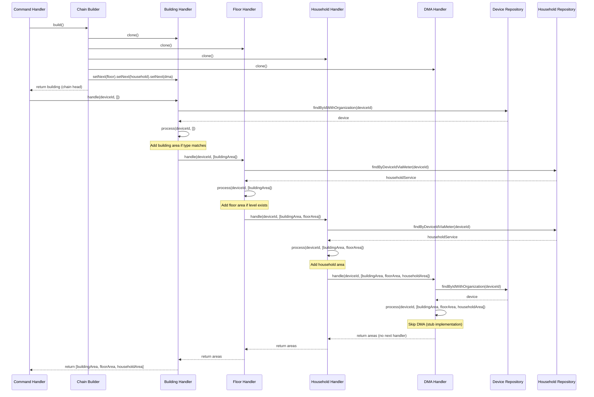

# Chain of Responsibility Pattern with Repository Integration

> **Pattern:** Chain of Responsibility + Repository Pattern for sequential data enrichment

## Overview

The Chain of Responsibility pattern with Repository integration enables sequential, composable data processing where each handler enriches data by querying repositories independently. This pattern is ideal for building complex objects through multiple data sources without tight coupling.

---

## When to Use This Pattern

### Use Cases

✅ **GOOD - Use this pattern when:**

- Building composite data from multiple repositories/data sources
- Each enrichment step is optional and conditionally applied
- Processing order matters (hierarchical relationships)
- Handlers need independent repository access
- Business logic requires flexible, extensible processing pipelines
- You need to avoid nested callback hell or deeply coupled service calls

### Examples

```typescript
// ✅ GOOD - Area enrichment from multiple sources
// Building → Floor → Household → DMA
const areas = await areaChain.handle(deviceId, []);

// ✅ GOOD - User profile enrichment
// BasicInfo → Preferences → Subscriptions → Permissions
const profile = await profileChain.handle(userId, {});

// ✅ GOOD - Order processing pipeline
// Validation → Pricing → Inventory → Shipping → Tax
const order = await orderChain.handle(orderData, context);
```

❌ **BAD - Do NOT use this pattern when:**

- Simple single-step transformations
- No conditional logic required
- Linear processing with no branching
- Shared state between handlers creates complexity

---

## Pattern Structure

### 1. Handler Interface

**Purpose:** Defines contract for all chain handlers

**Location:** `src/modules/{module}/chain/{handler}.interface.ts`

```typescript
export interface IAreaHandler {
  /**
   * Links next handler in chain
   * @param handler - Next handler to process
   * @returns The passed handler for fluent chaining
   */
  setNext(handler: IAreaHandler): IAreaHandler;

  /**
   * Processes data and passes to next handler
   * @param deviceId - Input identifier
   * @param areas - Accumulated data from previous handlers
   * @returns Enriched data array with this handler's contribution
   */
  handle(deviceId: string, areas: AreaDto[]): Promise<AreaDto[]>;

  /**
   * Creates new instance for chain builder
   * CRITICAL: Required for NestJS singleton handlers to avoid shared state
   */
  clone(): IAreaHandler;
}
```

**Key Methods:**

| Method | Purpose | Returns |
|--------|---------|---------|
| `setNext()` | Link next handler | Next handler (for fluent chaining) |
| `handle()` | Process and accumulate data | Enriched data |
| `clone()` | Create fresh instance | New handler instance |

---

### 2. Base Handler (Abstract Class)

**Purpose:** Implements common chain logic, enforces template method pattern

**Location:** `src/modules/{module}/chain/base-{handler}.handler.ts`

```typescript
import { Injectable } from '@nestjs/common';
import { AreaDto } from '../dto/area.dto';
import { IAreaHandler } from './area-handler.interface';

/**
 * Abstract base class implementing common chain logic
 * Template Method Pattern: handle() orchestrates, process() varies
 */
@Injectable()
export abstract class BaseAreaHandler implements IAreaHandler {
  protected nextHandler?: IAreaHandler;

  setNext(handler: IAreaHandler): IAreaHandler {
    this.nextHandler = handler;
    return handler; // Enables fluent chaining
  }

  async handle(deviceId: string, areas: AreaDto[]): Promise<AreaDto[]> {
    // Step 1: Process current handler's logic
    const processedAreas = await this.process(deviceId, areas);

    // Step 2: Pass to next handler if exists
    if (this.nextHandler) {
      return await this.nextHandler.handle(deviceId, processedAreas);
    }

    // Step 3: Return final result if end of chain
    return processedAreas;
  }

  /**
   * Subclass-specific processing logic
   * MUST return enriched data (preserve existing + add new)
   */
  protected abstract process(deviceId: string, areas: AreaDto[]): Promise<AreaDto[]>;

  /**
   * Clone handler to avoid shared state in NestJS singletons
   */
  abstract clone(): IAreaHandler;
}
```

**Critical Pattern Rules:**

1. **Template Method:** `handle()` is final, `process()` is overridden
2. **Accumulation:** Always preserve existing data: `[...areas, newData]`
3. **Optional Processing:** Return unchanged data if conditions not met
4. **Chain Continuation:** Delegate to `nextHandler` if exists

---

### 3. Concrete Handlers

**Purpose:** Implement specific enrichment logic with repository access

**Location:** `src/modules/{module}/chain/impl/{handler-name}.handler.ts`

#### Example: Building Area Handler

```typescript
import { Inject, Injectable } from '@nestjs/common';
import { BaseAreaHandler } from '../base-area.handler';
import { IAreaHandler } from '../area-handler.interface';
import { AreaDto } from '../../dto/area.dto';
import { IDeviceRepository, DEVICE_REPOSITORY } from 'src/shared/domain/repository';

@Injectable()
export class BuildingAreaHandler extends BaseAreaHandler {
  constructor(
    @Inject(DEVICE_REPOSITORY)
    private readonly deviceRepository: IDeviceRepository,
  ) {
    super();
  }

  protected async process(deviceId: string, areas: AreaDto[]): Promise<AreaDto[]> {
    // Step 1: Query repository
    const device = await this.deviceRepository.findByIdWithOrganization(deviceId);

    // Step 2: Guard clauses - skip if conditions not met
    if (!device?.organization) {
      return areas; // ✅ Preserve existing areas
    }

    if (device.organization.type !== 'building') {
      return areas; // ✅ Conditional processing
    }

    // Step 3: Accumulate enriched data
    return [
      ...areas, // ✅ CRITICAL: Preserve existing data
      new AreaDto({
        id: device.organization.id,
        name: device.organization.name,
        type: 'building',
      }),
    ];
  }

  clone(): IAreaHandler {
    // ✅ CRITICAL: Inject same repository instance (singleton)
    return new BuildingAreaHandler(this.deviceRepository);
  }
}
```

**Pattern Rules:**

| Rule | Requirement |
|------|-------------|
| **Repository Injection** | Use `@Inject(REPOSITORY_TOKEN)` with constant |
| **Guard Clauses** | Return `areas` unchanged if conditions not met |
| **Accumulation** | Always use `[...areas, newData]` spread operator |
| **Clone Method** | Pass injected dependencies to new instance |
| **Single Responsibility** | One data source/entity type per handler |

#### Example: Multi-Repository Handler

```typescript
@Injectable()
export class FloorAreaHandler extends BaseAreaHandler {
  constructor(
    @Inject(HOUSEHOLD_SERVICE_REPOSITORY)
    private readonly householdServiceRepository: IHouseholdServiceRepository,
  ) {
    super();
  }

  protected async process(deviceId: string, areas: AreaDto[]): Promise<AreaDto[]> {
    // Multiple repository methods (fallback pattern)
    const householdService = await this.findHouseholdServiceForDevice(deviceId);

    if (!householdService?.household?.level) {
      return areas;
    }

    return [
      ...areas,
      new AreaDto({
        id: householdService.household.id,
        name: `Floor ${householdService.household.level}`,
        type: 'floor',
      }),
    ];
  }

  private async findHouseholdServiceForDevice(deviceId: string) {
    // Fallback pattern: try multiple repository methods
    const meterService = await this.householdServiceRepository.findByDeviceIdViaMeter(deviceId);

    if (meterService) {
      return meterService;
    }

    return await this.householdServiceRepository.findByDeviceIdViaSensor(deviceId);
  }

  clone(): IAreaHandler {
    return new FloorAreaHandler(this.householdServiceRepository);
  }
}
```

---

### 4. Chain Builder

**Purpose:** Constructs chain in correct order, avoids shared state via cloning

**Location:** `src/modules/{module}/chain/{chain-name}-chain.builder.ts`

```typescript
import { Injectable } from '@nestjs/common';
import { IAreaHandler } from './area-handler.interface';
import { BuildingAreaHandler } from './impl/building-area.handler';
import { FloorAreaHandler } from './impl/floor-area.handler';
import { HouseholdAreaHandler } from './impl/household-area.handler';
import { DMAAreaHandler } from './impl/dma-area.handler';

/**
 * Builds area enrichment chain in correct order
 * Chain order: Building → Floor → Household → DMA
 */
@Injectable()
export class AreaChainBuilder {
  constructor(
    private readonly buildingHandler: BuildingAreaHandler,
    private readonly floorHandler: FloorAreaHandler,
    private readonly householdHandler: HouseholdAreaHandler,
    private readonly dmaHandler: DMAAreaHandler,
  ) {}

  /**
   * Builds and returns the head of the chain
   * CRITICAL: Clones handlers to avoid shared state between requests
   */
  build(): IAreaHandler {
    // Step 1: Clone all handlers (NestJS singletons require cloning)
    const building = this.buildingHandler.clone();
    const floor = this.floorHandler.clone();
    const household = this.householdHandler.clone();
    const dma = this.dmaHandler.clone();

    // Step 2: Link handlers using fluent interface
    building
      .setNext(floor)
      .setNext(household)
      .setNext(dma);

    // Step 3: Return chain head
    return building;
  }
}
```

**Critical Pattern Rules:**

| Rule | Why |
|------|-----|
| **Clone Handlers** | NestJS handlers are singletons; cloning prevents shared state bugs |
| **Fluent Chaining** | `setNext()` returns next handler for chainable syntax |
| **Order Matters** | Chain sequence defines processing order (document in comment) |
| **Return Head** | First handler in chain is the entry point |

**Anti-Patterns:**

```typescript
// ❌ BAD - No cloning (shared state across requests)
build(): IAreaHandler {
  this.buildingHandler
    .setNext(this.floorHandler)
    .setNext(this.householdHandler);
  return this.buildingHandler; // Shared state!
}

// ❌ BAD - Nested setNext (hard to read)
build(): IAreaHandler {
  const building = this.buildingHandler.clone();
  building.setNext(
    this.floorHandler.clone().setNext(
      this.householdHandler.clone()
    )
  );
  return building;
}
```

---

### 5. Command Handler Integration

**Purpose:** Use chain within CQRS command handler

**Location:** `src/modules/{module}/commands/handlers/{action}.handler.ts`

```typescript
import { Injectable } from '@nestjs/common';
import { CommandHandler, ICommandHandler } from '@nestjs/cqrs';
import { BuildAreasCommand } from '../build-areas.command';
import { AreaDto } from '../../dto/area.dto';
import { AreaChainBuilder } from '../../chain/area-chain.builder';

/**
 * Builds areas array using Chain of Responsibility
 * @returns Areas array with hierarchical location context
 */
@Injectable()
@CommandHandler(BuildAreasCommand)
export class BuildAreasHandler implements ICommandHandler<BuildAreasCommand, AreaDto[]> {
  constructor(private readonly areaChainBuilder: AreaChainBuilder) {}

  async execute(command: BuildAreasCommand): Promise<AreaDto[]> {
    // Guard clause
    if (!command.deviceId) {
      return [];
    }

    // Step 1: Build fresh chain
    const chain = this.areaChainBuilder.build();

    // Step 2: Execute chain with initial empty array
    return await chain.handle(command.deviceId, []);
  }
}
```

**Pattern Rules:**

1. **Build Fresh Chain:** Call `builder.build()` on every execution
2. **Initial State:** Pass empty array `[]` or initial context object
3. **Guard Clauses:** Validate inputs before chain execution
4. **Return Final Result:** Chain returns accumulated result

---

### 6. Module Registration

**Purpose:** Register all handlers and builder in NestJS module using index.ts pattern

#### Step 1: Create Chain Handlers Index File

**IMPORTANT:** Export only the array, NOT individual classes

**Location:** `src/modules/{module}/chain/index.ts`

```typescript
// ✅ GOOD - Export only the array
import { BuildingAreaHandler } from './impl/building-area.handler';
import { FloorAreaHandler } from './impl/floor-area.handler';
import { HouseholdAreaHandler } from './impl/household-area.handler';
import { DMAAreaHandler } from './impl/dma-area.handler';

export const ChainHandlers = [
  BuildingAreaHandler,
  FloorAreaHandler,
  HouseholdAreaHandler,
  DMAAreaHandler,
];

// ❌ DO NOT re-export individual classes like this:
// export * from './impl/building-area.handler';
// export * from './impl/floor-area.handler';
// export * from './impl/household-area.handler';
// export * from './impl/dma-area.handler';
```

**Why NOT re-export classes?**

- ❌ Creates namespace pollution
- ❌ Encourages direct class imports instead of using the array
- ❌ Makes module boundaries unclear
- ✅ Export ONLY the array for module registration

#### Step 2: Register in Module

**Location:** `src/modules/{module}/{module}.module.ts`

```typescript
import { Module } from '@nestjs/common';
import { CommandHandlers } from './commands';
import { AreaChainBuilder } from './chain/area-chain.builder';
import { ChainHandlers } from './chain'; // Import from index.ts

@Module({
  providers: [
    ...CommandHandlers,
    ...ChainHandlers, // Spread chain handlers array
    AreaChainBuilder, // Builder depends on all handlers
  ],
  exports: [...CommandHandlers],
})
export class AreaModule {}
```

**Registration Rules:**

| Component | Registration | Why |
|-----------|-------------|-----|
| **Chain Handlers** | `providers` array via index.ts | NestJS singletons for DI |
| **Builder** | `providers` array | Injects all handlers |
| **Command Handlers** | `exports` array | Available to other modules |

**Benefits of Index Pattern:**

- ✅ Cleaner imports in module files
- ✅ Centralized list of all chain handlers
- ✅ Easy to add/remove handlers
- ✅ Consistent with application design standards
- ✅ Prevents accidental direct class imports

---

## Complete Flow Diagram



---

## Testing Strategy

### 1. Handler Unit Tests

**Test each handler in isolation with mocked repositories**

**Location:** `src/modules/{module}/chain/impl/{handler-name}.handler.spec.ts`

```typescript
import { Test, TestingModule } from '@nestjs/testing';
import { createMock, DeepMocked } from '@golevelup/ts-jest';
import { BuildingAreaHandler } from './building-area.handler';
import { IDeviceRepository, DEVICE_REPOSITORY } from 'src/shared/domain/repository';
import { Device, Organization } from 'src/shared/domain/entity';
import { AreaDto } from '../../dto/area.dto';
import { IAreaHandler } from '../area-handler.interface';

describe('BuildingAreaHandler', () => {
  let target: BuildingAreaHandler;
  let mockDeviceRepository: DeepMocked<IDeviceRepository>;

  beforeEach(async () => {
    mockDeviceRepository = createMock<IDeviceRepository>();

    const module: TestingModule = await Test.createTestingModule({
      providers: [
        BuildingAreaHandler,
        { provide: DEVICE_REPOSITORY, useValue: mockDeviceRepository },
      ],
    })
      .setLogger(new MockLoggerService())
      .compile();

    target = module.get<BuildingAreaHandler>(BuildingAreaHandler);
  });

  describe('process', () => {
    it('should add building area when organization type is building', async () => {
      // Arrange
      const deviceId = 'device-123';
      const organization = new Organization({
        id: 'org-1',
        name: 'Test Building',
        type: 'building',
        isDeleted: 0,
      });
      const device = new Device({ id: deviceId, organization, isDeleted: 0 });
      mockDeviceRepository.findByIdWithOrganization.mockResolvedValue(device);

      // Act
      const result = await target.handle(deviceId, []);

      // Assert
      expect(result).toHaveLength(1);
      expect(result[0]).toMatchObject({
        id: 'org-1',
        name: 'Test Building',
        type: 'building',
      });
    });

    it('should skip when organization type is not building', async () => {
      // Arrange
      const organization = new Organization({
        id: 'org-1',
        name: 'Utility Corp',
        type: 'utility',
        isDeleted: 0,
      });
      const device = new Device({ id: 'device-123', organization, isDeleted: 0 });
      mockDeviceRepository.findByIdWithOrganization.mockResolvedValue(device);

      // Act
      const result = await target.handle('device-123', []);

      // Assert
      expect(result).toHaveLength(0);
    });

    it('should preserve existing areas in the chain', async () => {
      // Arrange
      const existingArea = new AreaDto({ id: 'existing-1', name: 'Existing', type: 'custom' });
      const organization = new Organization({
        id: 'org-1',
        name: 'Building A',
        type: 'building',
        isDeleted: 0,
      });
      const device = new Device({ id: 'device-123', organization, isDeleted: 0 });
      mockDeviceRepository.findByIdWithOrganization.mockResolvedValue(device);

      // Act
      const result = await target.handle('device-123', [existingArea]);

      // Assert
      expect(result).toHaveLength(2);
      expect(result[0]).toEqual(existingArea); // ✅ Preserved
      expect(result[1].type).toBe('building');
    });

    it('should pass to next handler when set', async () => {
      // Arrange
      const mockNextHandler = createMock<IAreaHandler>();
      mockNextHandler.handle.mockResolvedValue([
        new AreaDto({ id: 'next-1', name: 'Next', type: 'custom' }),
      ]);
      target.setNext(mockNextHandler);
      mockDeviceRepository.findByIdWithOrganization.mockResolvedValue(null);

      // Act
      const result = await target.handle('device-123', []);

      // Assert
      expect(mockNextHandler.handle).toHaveBeenCalledWith('device-123', []);
      expect(result).toHaveLength(1);
      expect(result[0].id).toBe('next-1');
    });
  });

  describe('clone', () => {
    it('should create a new instance with same repository', () => {
      // Act
      const cloned = target.clone();

      // Assert
      expect(cloned).toBeInstanceOf(BuildingAreaHandler);
      expect(cloned).not.toBe(target); // Different instances
    });
  });
});
```

**Test Coverage Requirements:**

- ✅ Happy path: Handler adds data when conditions met
- ✅ Skip path: Handler returns unchanged data when conditions not met
- ✅ Guard clauses: Null/undefined handling
- ✅ Data preservation: Existing data not lost
- ✅ Chain delegation: Next handler called correctly
- ✅ Clone: New instance created

---

### 2. Chain Builder Tests

**Test builder constructs chain correctly**

**Location:** `src/modules/{module}/chain/{chain-name}-chain.builder.spec.ts`

```typescript
describe('AreaChainBuilder', () => {
  let target: AreaChainBuilder;
  let mockBuildingHandler: DeepMocked<BuildingAreaHandler>;
  let mockFloorHandler: DeepMocked<FloorAreaHandler>;
  let mockHouseholdHandler: DeepMocked<HouseholdAreaHandler>;
  let mockDMAHandler: DeepMocked<DMAAreaHandler>;

  beforeEach(async () => {
    mockBuildingHandler = createMock<BuildingAreaHandler>();
    mockFloorHandler = createMock<FloorAreaHandler>();
    mockHouseholdHandler = createMock<HouseholdAreaHandler>();
    mockDMAHandler = createMock<DMAAreaHandler>();

    const module: TestingModule = await Test.createTestingModule({
      providers: [
        AreaChainBuilder,
        { provide: BuildingAreaHandler, useValue: mockBuildingHandler },
        { provide: FloorAreaHandler, useValue: mockFloorHandler },
        { provide: HouseholdAreaHandler, useValue: mockHouseholdHandler },
        { provide: DMAAreaHandler, useValue: mockDMAHandler },
      ],
    })
      .setLogger(new MockLoggerService())
      .compile();

    target = module.get<AreaChainBuilder>(AreaChainBuilder);
  });

  it('should clone all handlers before chaining', () => {
    // Arrange
    const clonedBuilding = createMock<IAreaHandler>();
    const clonedFloor = createMock<IAreaHandler>();
    const clonedHousehold = createMock<IAreaHandler>();
    const clonedDMA = createMock<IAreaHandler>();

    mockBuildingHandler.clone.mockReturnValue(clonedBuilding);
    mockFloorHandler.clone.mockReturnValue(clonedFloor);
    mockHouseholdHandler.clone.mockReturnValue(clonedHousehold);
    mockDMAHandler.clone.mockReturnValue(clonedDMA);

    clonedBuilding.setNext.mockReturnValue(clonedFloor);
    clonedFloor.setNext.mockReturnValue(clonedHousehold);
    clonedHousehold.setNext.mockReturnValue(clonedDMA);

    // Act
    target.build();

    // Assert
    expect(mockBuildingHandler.clone).toHaveBeenCalled();
    expect(mockFloorHandler.clone).toHaveBeenCalled();
    expect(mockHouseholdHandler.clone).toHaveBeenCalled();
    expect(mockDMAHandler.clone).toHaveBeenCalled();
  });

  it('should chain handlers in correct order: Building → Floor → Household → DMA', () => {
    // Arrange
    const clonedBuilding = createMock<IAreaHandler>();
    const clonedFloor = createMock<IAreaHandler>();
    const clonedHousehold = createMock<IAreaHandler>();
    const clonedDMA = createMock<IAreaHandler>();

    mockBuildingHandler.clone.mockReturnValue(clonedBuilding);
    mockFloorHandler.clone.mockReturnValue(clonedFloor);
    mockHouseholdHandler.clone.mockReturnValue(clonedHousehold);
    mockDMAHandler.clone.mockReturnValue(clonedDMA);

    clonedBuilding.setNext.mockReturnValue(clonedFloor);
    clonedFloor.setNext.mockReturnValue(clonedHousehold);
    clonedHousehold.setNext.mockReturnValue(clonedDMA);

    // Act
    target.build();

    // Assert
    expect(clonedBuilding.setNext).toHaveBeenCalledWith(clonedFloor);
    expect(clonedFloor.setNext).toHaveBeenCalledWith(clonedHousehold);
    expect(clonedHousehold.setNext).toHaveBeenCalledWith(clonedDMA);
  });

  it('should create independent chains on multiple builds', () => {
    // Arrange
    const clonedBuilding1 = createMock<IAreaHandler>();
    const clonedBuilding2 = createMock<IAreaHandler>();

    mockBuildingHandler.clone
      .mockReturnValueOnce(clonedBuilding1)
      .mockReturnValueOnce(clonedBuilding2);

    // Act
    const chain1 = target.build();
    const chain2 = target.build();

    // Assert
    expect(chain1).not.toBe(chain2); // ✅ Independent chains
    expect(mockBuildingHandler.clone).toHaveBeenCalledTimes(2);
  });
});
```

**Test Coverage:**

- ✅ All handlers cloned
- ✅ Correct chain order
- ✅ Returns head of chain
- ✅ Multiple builds create independent chains

---

## Common Pitfalls and Solutions

### Pitfall 1: Shared State Across Requests

**Problem:**

```typescript
// ❌ BAD - NestJS handlers are singletons
build(): IAreaHandler {
  this.buildingHandler // Singleton instance
    .setNext(this.floorHandler) // Shared state!
    .setNext(this.householdHandler);
  return this.buildingHandler;
}
```

**Impact:** Concurrent requests corrupt chain state

**Solution:**

```typescript
// ✅ GOOD - Clone handlers
build(): IAreaHandler {
  const building = this.buildingHandler.clone(); // Fresh instance
  const floor = this.floorHandler.clone();
  building.setNext(floor);
  return building;
}
```

---

### Pitfall 2: Losing Accumulated Data

**Problem:**

```typescript
// ❌ BAD - Discards existing areas
protected async process(deviceId: string, areas: AreaDto[]): Promise<AreaDto[]> {
  const area = await this.getArea(deviceId);
  return [area]; // Lost existing areas!
}
```

**Solution:**

```typescript
// ✅ GOOD - Preserve existing data
protected async process(deviceId: string, areas: AreaDto[]): Promise<AreaDto[]> {
  const area = await this.getArea(deviceId);
  return [...areas, area]; // Spread operator
}
```

---

### Pitfall 3: Forgetting Guard Clauses

**Problem:**

```typescript
// ❌ BAD - Always adds area (null name if device missing)
protected async process(deviceId: string, areas: AreaDto[]): Promise<AreaDto[]> {
  const device = await this.repository.findById(deviceId);
  return [...areas, new AreaDto({ name: device.name })]; // NPE!
}
```

**Solution:**

```typescript
// ✅ GOOD - Guard clauses
protected async process(deviceId: string, areas: AreaDto[]): Promise<AreaDto[]> {
  const device = await this.repository.findById(deviceId);

  if (!device) {
    return areas; // Skip if not found
  }

  return [...areas, new AreaDto({ name: device.name })];
}
```

---

### Pitfall 4: Wrong Clone Implementation

**Problem:**

```typescript
// ❌ BAD - Returns same instance
clone(): IAreaHandler {
  return this; // Shared state!
}

// ❌ BAD - Doesn't inject dependencies
clone(): IAreaHandler {
  return new BuildingAreaHandler(null); // NPE on repository call
}
```

**Solution:**

```typescript
// ✅ GOOD - New instance with injected dependencies
clone(): IAreaHandler {
  return new BuildingAreaHandler(this.deviceRepository);
}
```

---

## Benefits of This Pattern

| Benefit | Description |
|---------|-------------|
| **Open/Closed Principle** | Add new handlers without modifying existing ones |
| **Single Responsibility** | Each handler focuses on one data source/entity type |
| **Testability** | Handlers tested independently with mocked repositories |
| **Flexibility** | Change chain order or add/remove handlers easily |
| **No Coupling** | Handlers don't know about each other, only interface |
| **Reusability** | Handlers reused in different chains |
| **Conditional Logic** | Each handler decides if it should process |

---

## File Structure Summary

```
src/modules/{module}/
├── chain/
│   ├── {handler}.interface.ts        # Handler contract
│   ├── base-{handler}.handler.ts     # Abstract base class
│   ├── {chain}-chain.builder.ts      # Chain builder
│   ├── {chain}-chain.builder.spec.ts # Builder tests
│   ├── index.ts                      # ✅ REQUIRED: Exports ChainHandlers array
│   └── impl/
│       ├── {handler-1}.handler.ts
│       ├── {handler-1}.handler.spec.ts
│       ├── {handler-2}.handler.ts
│       ├── {handler-2}.handler.spec.ts
│       └── ...
├── commands/
│   ├── index.ts                      # Exports CommandHandlers array
│   └── handlers/
│       └── {action}.handler.ts       # Uses chain builder
└── {module}.module.ts                # Registers all components via index.ts imports
```

---

## Quick Checklist

### Creating a New Chain Handler

- [ ] Extend `BaseAreaHandler`
- [ ] Inject repository with `@Inject(REPOSITORY_TOKEN)`
- [ ] Implement `process()` with guard clauses
- [ ] Always preserve existing data: `[...areas, newData]`
- [ ] Implement `clone()` with injected dependencies
- [ ] Write unit tests for all paths
- [ ] Add to `chain/index.ts` ChainHandlers array
- [ ] Add to chain builder in correct order

### Creating a Chain Builder

- [ ] Inject all handler types in constructor
- [ ] Clone all handlers in `build()`
- [ ] Chain handlers using fluent `setNext()`
- [ ] Document chain order in comments
- [ ] Return chain head
- [ ] Write tests for cloning and chaining

### Setting Up Chain Module

- [ ] Create `chain/index.ts` with ChainHandlers array
- [ ] Export ONLY the array (no individual class exports)
- [ ] Import ChainHandlers in module from `./chain`
- [ ] Spread ChainHandlers in providers array
- [ ] Register AreaChainBuilder in providers

### Using Chain in Command Handler

- [ ] Inject chain builder
- [ ] Call `builder.build()` on every execution
- [ ] Pass initial state (empty array/object)
- [ ] Add guard clauses for inputs
- [ ] Return final accumulated result

---

## Related Patterns

| Pattern | Relationship | When to Use Instead |
|---------|-------------|---------------------|
| **Strategy Pattern** | Chain selects handler dynamically | Need to swap entire algorithm, not compose steps |
| **Decorator Pattern** | Chain accumulates behavior | Need to add/remove behavior at runtime |
| **Pipeline Pattern** | Chain processes sequentially | All steps are required (no conditional logic) |
| **Repository Pattern** | Chain uses repositories | Direct data access without enrichment chain |

---

## References

- [Gang of Four: Chain of Responsibility](https://refactoring.guru/design-patterns/chain-of-responsibility)
- [NestJS Dependency Injection](https://docs.nestjs.com/fundamentals/custom-providers)
- [Template Method Pattern](https://refactoring.guru/design-patterns/template-method)

---

**Last Updated:** 2025-12-25
**Document Status:** ✅ Active
**Next Review:** 2026-01-25
