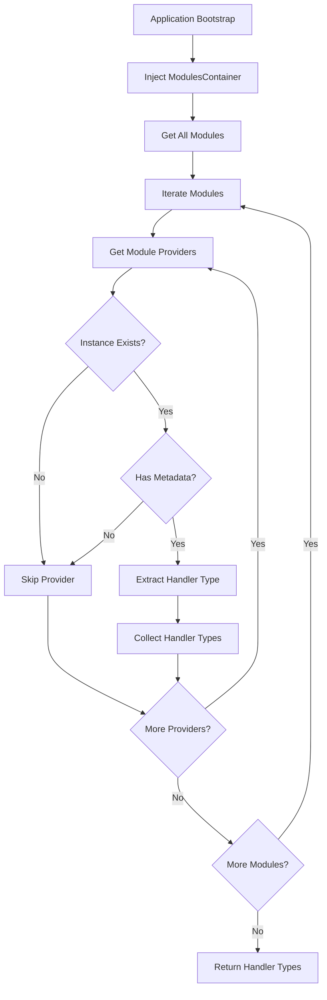
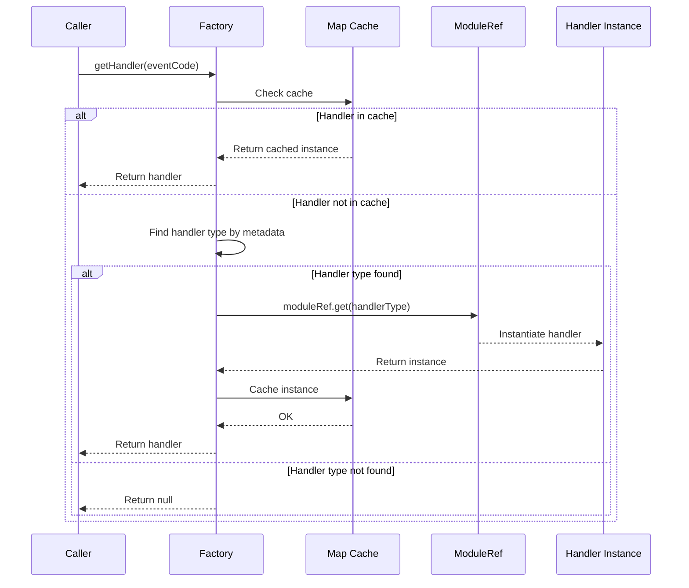
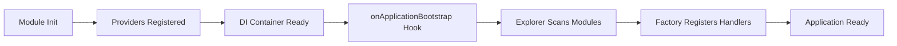
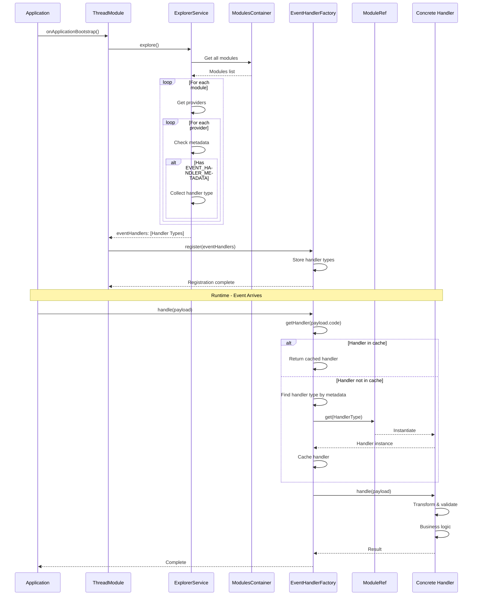

# Factory Pattern with Explorer (Auto-Discovery)

> **Pattern:** Factory + Explorer + Custom Decorator for dynamic handler registration and discovery

## Overview

The Factory with Explorer pattern enables automatic discovery and registration of handlers at application bootstrap using TypeScript decorators and reflection metadata. This pattern eliminates manual handler registration, supports dynamic routing based on event codes, and provides type-safe handler resolution.

---

## When to Use This Pattern

### Use Cases

✅ **GOOD - Use this pattern when:**

- Multiple handlers process different event types dynamically
- Handler registration should be automatic (no manual wiring)
- Event routing based on runtime data (event codes, message types)
- System needs to discover handlers across multiple modules
- Adding new handlers shouldn't require modifying factory code
- Handler instances should be cached for performance

### Examples

```typescript
// ✅ GOOD - Domain event handling with multiple event types
await eventHandlerFactory.handle(payload); // Routes to correct handler based on event code

// ✅ GOOD - Message processing with different message types
const handler = await messageFactory.getHandler(message.type);

// ✅ GOOD - Command routing based on command name
const processor = await commandFactory.getHandler(commandName);
```

❌ **BAD - Do NOT use this pattern when:**

- Only one or two handlers exist (overkill)
- Handler selection is static at compile time
- No need for automatic discovery (manual registration is simpler)
- Performance-critical paths (reflection has overhead)

---

## Pattern Structure

### 1. Handler Interface

**Purpose:** Defines contract for all event handlers

**Location:** `src/modules/{module}/usecases/{handler-type}/{handler-name}.interface.ts`

**Example:** `src/modules/thread/usecases/domain-event-handlers/domain-event-handler.interface.ts`

**Pattern 1: Fixed Payload and Return Types**

Use when all handlers process the same payload/return structure:

```typescript
import { EventPayload } from '../models/event-payload.dto';
import { ProcessingResult } from '../models/processing-result.dto';

/**
 * Handler interface for processing events
 * All handlers use the same payload and return types
 */
export interface IEventHandler {
  /**
   * Processes event payload
   * @param payload - Event payload data
   * @returns Processing result
   */
  handle(payload: EventPayload): Promise<ProcessingResult>;
}
```

**Pattern 2: Generic Types with Wrapper Object**

Use when different handlers need different payload types, but all share a common wrapper structure:

```typescript
import { CBLDomainEventPayload } from 'src/shared/domain/model/cbl-domain-event-payload.dto';
import { UpsertThreadPayload } from '../models/upsert-thread-payload.dto';

/**
 * Domain event handler interface for CBL events
 * Each handler processes a specific CBL event type (amendment, inquiry, etc.)
 * Generic type parameter <T> specifies the exact data type for each handler
 */
export interface IDomainEventHandler<T> {
  /**
   * Processes domain event payload
   * @param payload - Event payload with type-specific data
   * @returns Array of processed results
   */
  handle(payload: CBLDomainEventPayload<T>): Promise<UpsertThreadPayload[]>;
}

// Concrete implementation specifies exact type
export class CreateAmendmentHandler implements IDomainEventHandler<Ame001Data> {
  async handle(payload: CBLDomainEventPayload<Ame001Data>): Promise<UpsertThreadPayload[]> {
    // TypeScript knows payload.data is Ame001Data
  }
}
```

**Pattern Comparison:**

| Aspect | Pattern 1 (Fixed Types) | Pattern 2 (Generic Types) |
|--------|-------------------------|---------------------------|
| **Use When** | All handlers use same structure | Handlers have different payload data types |
| **Type Safety** | ✅ Full type safety | ✅ Full type safety per handler |
| **Complexity** | ✅ Simple | ⚠️ More complex |
| **Flexibility** | ❌ Less flexible | ✅ Very flexible |
| **IDE Support** | ✅ Excellent | ✅ Excellent |
| **Generic Default** | N/A | ✅ No default - force explicit type |

**❌ ANTI-PATTERNS - Never use these:**

```typescript
// ❌ BAD - Loses all type safety
export interface IEventHandler {
  handle(payload: any): Promise<any>;
}

// ❌ BAD - Unknown is too permissive, defeats type safety
export interface IEventHandler<T = unknown> {
  handle(payload: T): Promise<unknown>;
}

// ❌ BAD - Generic with any default
export interface IEventHandler<T = any> {
  handle(payload: T): Promise<T>;
}
```

**Why avoid `any` and `unknown` defaults:**
- `any`: Completely disables type checking
- `unknown`: Forces type guards everywhere, verbose and error-prone
- Both defeat TypeScript's purpose of compile-time safety
- Lead to runtime errors that TypeScript should catch

**✅ CORRECT - Always use concrete types:**

```typescript
// ✅ GOOD - Fixed concrete types
export interface IEventHandler {
  handle(payload: EventPayload): Promise<ProcessingResult>;
}

// ✅ GOOD - Generic without default (forces explicit type)
export interface IDomainEventHandler<T> {
  handle(payload: CBLDomainEventPayload<T>): Promise<UpsertThreadPayload[]>;
}

// ✅ Implementation must specify exact type
export class CreateAmendmentHandler implements IDomainEventHandler<Ame001Data> {
  // TypeScript enforces Ame001Data type
}
```

---

### 2. Custom Decorator for Handler Registration

**Purpose:** Marks classes as event handlers with metadata

**Location:** `src/modules/{module}/usecases/{handler-type}/{handler-name}.decorator.ts`

**Example:** `src/modules/thread/usecases/domain-event-handlers/domain-event-handler.decorator.ts`

#### Step 2.1: Define Metadata Constant

**Location:** `src/modules/{module}/usecases/{handler-type}/constants.ts`

**Example:** `src/modules/thread/usecases/domain-event-handlers/constants.ts`

```typescript
export const EVENT_HANDLER_METADATA = '__EVENT_HANDLER_METADATA__H1Q2aTRjh1tR';
```

**Best Practices:**

- Use unique string to avoid metadata key collisions
- Add random suffix (e.g., `H1Q2aTRjh1tR`) for uniqueness
- Export as constant for reuse in decorator, explorer, and factory

#### Step 2.2: Create Decorator

```typescript
import { CBLEventCode } from 'src/shared/domain/enum/bl-summary.enum';
import { EVENT_HANDLER_METADATA } from './constants';

/**
 * Decorator to mark classes as domain event handlers
 * Stores event code in reflection metadata for auto-discovery
 * @param eventCode - Event code this handler processes
 */
export const InjectableEventHandler = (eventCode: CBLEventCode): ClassDecorator => {
  return (target: object) => {
    Reflect.defineMetadata(EVENT_HANDLER_METADATA, eventCode, target);
  };
};
```

**Decorator Pattern Rules:**

| Rule | Description |
|------|-------------|
| **ClassDecorator Type** | Ensures type safety for class decoration |
| **Reflect.defineMetadata** | Stores event code on class constructor |
| **Unique Metadata Key** | Prevents collisions with other decorators |
| **Event Code Parameter** | Associates handler with specific event |

**Usage Example:**

```typescript
@Injectable()
@InjectableEventHandler(CBLEventCode.CREATE_AMENDMENT)
export class CreateAmendmentHandler implements IDomainEventHandler<Ame001Data> {
  // Handler implementation
}
```

---

### 3. Explorer Service (Auto-Discovery)

**Purpose:** Scans NestJS modules to discover decorated handlers at bootstrap

**Location:** `src/modules/{module}/usecases/{handler-type}/{handler-name}.explorer.ts`

**Example:** `src/modules/thread/usecases/domain-event-handlers/domain-event-handler.explorer.ts`

```typescript
import { Injectable, Type } from '@nestjs/common';
import { ModulesContainer } from '@nestjs/core';
import { InstanceWrapper } from '@nestjs/core/injector/instance-wrapper';
import { Module } from '@nestjs/core/injector/module';
import { EVENT_HANDLER_METADATA } from './constants';
import { IDomainEventHandler } from './event-handler.interface';

export interface DomainEventHandlerOptions {
  eventHandlers: Type<IDomainEventHandler>[];
}

/**
 * Discovers domain event handlers decorated with @InjectableEventHandler
 * Scans all NestJS modules at application bootstrap
 * IMPORTANT: Name should be specific to handler type (e.g., DomainEventHandlerExplorer, CommandHandlerExplorer)
 */
@Injectable()
export class DomainEventHandlerExplorer {
  constructor(private readonly modulesContainer: ModulesContainer) {}

  /**
   * Explores all modules and extracts decorated event handlers
   * @returns Object containing discovered handler types
   */
  explore(): DomainEventHandlerOptions {
    const modules = [...this.modulesContainer.values()];
    const eventHandlers = this.flatMap<IDomainEventHandler>(
      modules,
      (instance) => this.filterProvider(instance, EVENT_HANDLER_METADATA)
    );

    return { eventHandlers };
  }

  /**
   * Flattens module providers and applies filter callback
   * @param modules - All NestJS modules
   * @param callback - Filter function to extract handler types
   * @returns Flattened array of handler types
   */
  flatMap<T>(
    modules: Module[],
    callback: (instance: InstanceWrapper) => Type<any> | undefined
  ): Type<T>[] {
    const items = modules
      .map((module) => [...module.providers.values()].map(callback))
      .reduce((a, b) => a.concat(b), []);
    return items.filter((element) => !!element) as Type<T>[];
  }

  /**
   * Filters provider by checking for metadata
   * @param wrapper - NestJS instance wrapper
   * @param metadataKey - Metadata key to check
   * @returns Handler type if metadata exists, undefined otherwise
   */
  filterProvider(wrapper: InstanceWrapper, metadataKey: string): Type<any> | undefined {
    const { instance } = wrapper;
    if (!instance) {
      return undefined;
    }
    return this.extractMetadata(instance, metadataKey);
  }

  /**
   * Extracts metadata from instance constructor
   * @param instance - Handler instance
   * @param metadataKey - Metadata key to retrieve
   * @returns Handler type if metadata exists, undefined otherwise
   */
  extractMetadata(instance: Record<string, any>, metadataKey: string): Type<any> {
    if (!instance.constructor) {
      return undefined;
    }
    const metadata = Reflect.getMetadata(metadataKey, instance.constructor);
    return metadata ? (instance.constructor as Type<any>) : undefined;
  }
}
```

**Critical Explorer Methods:**

| Method | Purpose | Returns |
|--------|---------|---------|
| `explore()` | Main entry point, scans all modules | Handler types array |
| `flatMap()` | Flattens providers across modules | Filtered handler types |
| `filterProvider()` | Checks if provider has decorator | Handler type or undefined |
| `extractMetadata()` | Retrieves metadata from constructor | Metadata value or undefined |

**How Explorer Works:**



---

### 4. Factory Service (Handler Registry and Dispatcher)

**Purpose:** Registers handlers, resolves by event code, caches instances

**Location:** `src/modules/{module}/usecases/{handler-type}/{handler-name}.factory.ts`

**Example:** `src/modules/thread/usecases/domain-event-handlers/domain-event-handler.factory.ts`

```typescript
import { Injectable, Logger, Type } from '@nestjs/common';
import { ModuleRef } from '@nestjs/core';
import { CBLEventCode } from 'src/shared/domain/enum/bl-summary.enum';
import { IDomainEventHandler } from './event-handler.interface';
import { CBLDomainEventPayload } from 'src/shared/domain/model/cbl-domain-event-payload.dto';
import { EVENT_HANDLER_METADATA } from './constants';

export type DomainEventHandlerType = Type<IDomainEventHandler>;

/**
 * Factory for resolving and caching domain event handlers
 * Lazily instantiates handlers on first access
 * IMPORTANT: Name should be specific to handler type (e.g., DomainEventHandlerFactory, CommandHandlerFactory)
 */
@Injectable()
export class DomainEventHandlerFactory {
  private readonly logger = new Logger(DomainEventHandlerFactory.name);
  private eventHandlerTypes: DomainEventHandlerType[] = [];
  private readonly handlers = new Map<CBLEventCode, IDomainEventHandler>();

  constructor(private readonly moduleRef: ModuleRef) {}

  /**
   * Gets handler for event code (lazy instantiation + caching)
   * @param eventCode - Event code to find handler for
   * @returns Handler instance or null if not found
   */
  async getHandler(eventCode: CBLEventCode): Promise<IDomainEventHandler | null> {
    // Step 1: Check cache
    if (this.handlers.has(eventCode)) {
      return this.handlers.get(eventCode);
    }

    // Step 2: Find handler type by event code metadata
    const handlerType = this.eventHandlerTypes.find(
      (type) => eventCode === Reflect.getMetadata(EVENT_HANDLER_METADATA, type)
    );

    if (!handlerType) {
      return null;
    }

    // Step 3: Resolve handler instance from NestJS DI container
    const handlerInstance = this.moduleRef.get<IDomainEventHandler>(handlerType, { strict: false });

    // Step 4: Cache for future requests
    this.handlers.set(eventCode, handlerInstance);

    return handlerInstance;
  }

  /**
   * Registers handler types discovered by Explorer
   * Called once at application bootstrap
   * @param eventHandlerTypes - Handler class types
   */
  register(eventHandlerTypes: DomainEventHandlerType[]): void {
    this.eventHandlerTypes = eventHandlerTypes;
    this.logger.log(`Registered ${this.eventHandlerTypes.length} event handlers successfully`);
  }

  /**
   * Routes payload to correct handler and executes
   * @param payload - Domain event payload with event code
   */
  async handle(payload: CBLDomainEventPayload<any>): Promise<void> {
    const handler = await this.getHandler(payload.code);
    if (!handler) {
      return; // Silent skip if no handler registered
    }

    await handler.handle(payload);
  }
}
```

**Factory Pattern Rules:**

| Component | Responsibility |
|-----------|---------------|
| **eventHandlerTypes** | Stores handler class types (not instances) |
| **handlers Map** | Caches handler instances by event code |
| **ModuleRef** | Resolves handler instances from DI container |
| **register()** | Called once at bootstrap with discovered handlers |
| **getHandler()** | Lazy instantiation + caching |
| **handle()** | High-level dispatcher method |

**Lazy Instantiation Flow:**



---

### 5. Concrete Handler Implementation

**Purpose:** Implements handler interface for specific event type

**Location:** `src/modules/{module}/usecases/{handler-type}/{category}/{event-name}.handler.ts`

**Example:** `src/modules/thread/usecases/domain-event-handlers/amendment/create-amendment.handler.ts`

```typescript
import { Inject, Injectable, Logger } from '@nestjs/common';
import { plainToInstance } from 'class-transformer';
import { validate } from 'class-validator';
import { IDomainEventHandler } from '../event-handler.interface';
import { CBLDomainEventPayload } from 'src/shared/domain/model/cbl-domain-event-payload.dto';
import { ThreadRepository, ThreadRepositoryName } from '../../domain/thread.repository';
import { InjectableEventHandler } from '../event-handler.decorator';
import { CBLEventCode } from 'src/shared/domain/enum/bl-summary.enum';
import { UpsertThreadPayload } from '../../models/upsert-thread-payload.dto';
import { Ame001Data, Ame001DataItem } from 'src/shared/domain/model/event-data/ame-001.data-model';
import { DefaultTransformOptions, DefaultValidationOptions } from 'src/utils/config/validation.config';

@Injectable()
@InjectableEventHandler(CBLEventCode.CREATE_AMENDMENT) // ✅ Decorator with event code
export class CreateAmendmentHandler implements IDomainEventHandler<Ame001Data> {
  private readonly logger = new Logger(CreateAmendmentHandler.name);

  constructor(
    @Inject(ThreadRepositoryName)
    private readonly threadRepository: ThreadRepository,
  ) {}

  async handle(payload: CBLDomainEventPayload<Ame001Data>): Promise<UpsertThreadPayload[]> {
    // Step 1: Transform and validate payload
    const dataItems = await this.transformAndValidate(payload.data);

    this.logger.debug(`Processing ${dataItems.length} amendment items`);

    // Step 2: Business logic (repository operations, transformations, etc.)
    // ...

    return [];
  }

  private async transformAndValidate(data: Ame001Data): Promise<Ame001Data> {
    // Transform plain objects to class instances
    const dataItems = data.map((item) =>
      plainToInstance(Ame001DataItem, item, DefaultTransformOptions)
    );

    // Validate each item
    for (const item of dataItems) {
      const errors = await validate(item, DefaultValidationOptions);
      if (errors.length > 0) {
        throw DefaultValidationOptions.exceptionFactory(errors);
      }
    }

    return dataItems;
  }
}
```

**Handler Implementation Rules:**

| Rule | Requirement | Notes |
|------|-------------|-------|
| **@Injectable()** | ✅ Required | For NestJS DI |
| **@InjectableEventHandler()** | ✅ Required | With unique event code |
| **implements Interface** | ✅ Required | Ensures interface compliance |
| **Generic Type Parameter** | ⚠️ Optional | Use if handler interface has generics (e.g., `IDomainEventHandler<Ame001Data>`) |
| **Repository Injection** | ✅ Required | Use `@Inject(REPOSITORY_TOKEN)` with constant |
| **Logging** | ✅ Recommended | Include logger for debugging |
| **Validation** | ✅ Recommended | Transform and validate payload data |

**Note:** The example above uses `IDomainEventHandler<Ame001Data>` with a generic type parameter for compile-time type safety. This is **optional** - you can use a simpler interface like `IEventHandler` without generics if your handlers all use the same payload structure.

---

### 6. Module Bootstrap Integration

**Purpose:** Wire explorer and factory at application startup

**Location:** `src/modules/{module}/{module}.module.ts`

#### Step 6.1: Create Handlers Index File

**Location:** `src/modules/{module}/usecases/{handler-type}/index.ts`

**Example:** `src/modules/thread/usecases/domain-event-handlers/index.ts`

```typescript
import { CreateAmendmentHandler } from './amendment/create-amendment.handler';
import { ResolveAmendmentHandler } from './amendment/resolve-amendment.handler';
import { SubmitAmendmentHandler } from './amendment/submit-amendment.handler';

export const DomainEventHandlers = [
  CreateAmendmentHandler,
  ResolveAmendmentHandler,
  SubmitAmendmentHandler,
];
```

#### Step 6.2: Register in Module with Bootstrap Hook

```typescript
import { Module, OnApplicationBootstrap } from '@nestjs/common';
import { CqrsModule } from '@nestjs/cqrs';
import { ThreadController } from './thread.controller';
import { Usecases } from './usecases';
import { DomainEventHandlerFactory } from './usecases/domain-event-handlers/domain-event-handler.factory';
import { DomainEventHandlerExplorer } from './usecases/domain-event-handlers/domain-event-handler.explorer';
import { DomainEventHandlers } from './usecases/domain-event-handlers';

@Module({
  imports: [CqrsModule],
  controllers: [ThreadController],
  providers: [
    ...Usecases,
    ...DomainEventHandlers, // ✅ Register handlers in providers
    DomainEventHandlerFactory, // ✅ Register factory (specific name)
    DomainEventHandlerExplorer, // ✅ Register explorer (specific name)
  ],
})
export class ThreadModule implements OnApplicationBootstrap {
  constructor(
    private readonly domainEventHandlerExplorer: DomainEventHandlerExplorer,
    private readonly domainEventHandlerFactory: DomainEventHandlerFactory,
  ) {}

  /**
   * Called after all modules initialized
   * Discovers and registers domain event handlers
   */
  onApplicationBootstrap(): void {
    // Step 1: Discover decorated handlers
    const { eventHandlers } = this.domainEventHandlerExplorer.explore();

    // Step 2: Register with factory
    this.domainEventHandlerFactory.register(eventHandlers);
  }
}
```

**Bootstrap Lifecycle Rules:**

| Component | Registration | Purpose |
|-----------|-------------|---------|
| **Handlers** | `providers` array | Available for DI |
| **Factory** | `providers` array | Injectable singleton |
| **Explorer** | `providers` array | Injectable singleton |
| **OnApplicationBootstrap** | Implement lifecycle hook | Run discovery after DI ready |

**CRITICAL: Bootstrap Lifecycle Timing**



---

## Complete Flow Diagram



---

## Testing Strategy

### 1. Decorator Tests

**Test decorator applies metadata correctly**

**Location:** `src/modules/{module}/handlers/{handler}.decorator.spec.ts`

```typescript
import 'reflect-metadata';
import { InjectableEventHandler } from './event-handler.decorator';
import { CBLEventCode } from 'src/shared/domain/enum/bl-summary.enum';
import { EVENT_HANDLER_METADATA } from './constants';

describe('InjectableEventHandler Decorator', () => {
  it('should define metadata on target class', () => {
    @InjectableEventHandler(CBLEventCode.CREATE_AMENDMENT)
    class TestHandler {}

    const metadata = Reflect.getMetadata(EVENT_HANDLER_METADATA, TestHandler);
    expect(metadata).toBe(CBLEventCode.CREATE_AMENDMENT);
  });

  it('should work with different event codes', () => {
    @InjectableEventHandler(CBLEventCode.SUBMIT_AMENDMENT)
    class SubmitHandler {}

    @InjectableEventHandler(CBLEventCode.RESOLVE_AMENDMENT)
    class ResolveHandler {}

    expect(Reflect.getMetadata(EVENT_HANDLER_METADATA, SubmitHandler))
      .toBe(CBLEventCode.SUBMIT_AMENDMENT);
    expect(Reflect.getMetadata(EVENT_HANDLER_METADATA, ResolveHandler))
      .toBe(CBLEventCode.RESOLVE_AMENDMENT);
  });

  it('should allow decorator on any class', () => {
    @InjectableEventHandler(CBLEventCode.CREATE_INQUIRY)
    class AnyClass {
      someMethod() {
        return 'test';
      }
    }

    const metadata = Reflect.getMetadata(EVENT_HANDLER_METADATA, AnyClass);
    expect(metadata).toBe(CBLEventCode.CREATE_INQUIRY);
    expect(new AnyClass().someMethod()).toBe('test');
  });
});
```

**Test Coverage:**

- ✅ Metadata defined correctly
- ✅ Different event codes work
- ✅ Decorator doesn't break class functionality

---

### 2. Explorer Tests

**Test explorer discovers decorated handlers**

**Location:** `src/modules/{module}/handlers/explorer.service.spec.ts`

```typescript
import { Test, TestingModule } from '@nestjs/testing';
import { createMock, DeepMocked } from '@golevelup/ts-jest';
import { ModulesContainer } from '@nestjs/core';
import { ExplorerService } from './explorer.service';
import { EVENT_HANDLER_METADATA } from './constants';
import { IDomainEventHandler } from './event-handler.interface';
import { CBLEventCode } from 'src/shared/domain/enum/bl-summary.enum';
import { Module } from '@nestjs/core/injector/module';
import { InstanceWrapper } from '@nestjs/core/injector/instance-wrapper';

class MockHandler1 implements IDomainEventHandler {
  async handle(): Promise<any[]> {
    return [];
  }
}

class MockHandler2 implements IDomainEventHandler {
  async handle(): Promise<any[]> {
    return [];
  }
}

class NonDecoratedHandler implements IDomainEventHandler {
  async handle(): Promise<any[]> {
    return [];
  }
}

Reflect.defineMetadata(EVENT_HANDLER_METADATA, CBLEventCode.CREATE_AMENDMENT, MockHandler1);
Reflect.defineMetadata(EVENT_HANDLER_METADATA, CBLEventCode.SUBMIT_AMENDMENT, MockHandler2);

describe('ExplorerService', () => {
  let target: ExplorerService;
  let mockModulesContainer: DeepMocked<ModulesContainer>;

  beforeEach(async () => {
    mockModulesContainer = createMock<ModulesContainer>();

    const module: TestingModule = await Test.createTestingModule({
      providers: [
        ExplorerService,
        { provide: ModulesContainer, useValue: mockModulesContainer }
      ],
    })
      .setLogger(new MockLoggerService())
      .compile();

    target = module.get<ExplorerService>(ExplorerService);
  });

  it('should discover decorated event handlers', () => {
    // Arrange
    const mockHandler1Instance = new MockHandler1();
    const mockHandler2Instance = new MockHandler2();

    const mockWrapper1 = createMock<InstanceWrapper>({
      instance: mockHandler1Instance,
    });

    const mockWrapper2 = createMock<InstanceWrapper>({
      instance: mockHandler2Instance,
    });

    const mockModule = createMock<Module>({
      providers: new Map([
        ['handler1', mockWrapper1],
        ['handler2', mockWrapper2],
      ]),
    });

    mockModulesContainer.values.mockReturnValue([mockModule] as any);

    // Act
    const result = target.explore();

    // Assert
    expect(result.eventHandlers).toHaveLength(2);
    expect(result.eventHandlers).toContain(MockHandler1);
    expect(result.eventHandlers).toContain(MockHandler2);
  });

  it('should filter out non-decorated providers', () => {
    // Arrange
    const decoratedHandler = new MockHandler1();
    const nonDecoratedHandler = new NonDecoratedHandler();

    const mockWrapper1 = createMock<InstanceWrapper>({
      instance: decoratedHandler,
    });

    const mockWrapper2 = createMock<InstanceWrapper>({
      instance: nonDecoratedHandler,
    });

    const mockModule = createMock<Module>({
      providers: new Map([
        ['handler1', mockWrapper1],
        ['handler2', mockWrapper2],
      ]),
    });

    mockModulesContainer.values.mockReturnValue([mockModule] as any);

    // Act
    const result = target.explore();

    // Assert
    expect(result.eventHandlers).toHaveLength(1);
    expect(result.eventHandlers).toContain(MockHandler1);
    expect(result.eventHandlers).not.toContain(NonDecoratedHandler);
  });

  it('should handle multiple modules', () => {
    // Arrange
    const handler1 = new MockHandler1();
    const handler2 = new MockHandler2();

    const mockWrapper1 = createMock<InstanceWrapper>({ instance: handler1 });
    const mockWrapper2 = createMock<InstanceWrapper>({ instance: handler2 });

    const mockModule1 = createMock<Module>({
      providers: new Map([['handler1', mockWrapper1]]),
    });

    const mockModule2 = createMock<Module>({
      providers: new Map([['handler2', mockWrapper2]]),
    });

    mockModulesContainer.values.mockReturnValue([mockModule1, mockModule2] as any);

    // Act
    const result = target.explore();

    // Assert
    expect(result.eventHandlers).toHaveLength(2);
    expect(result.eventHandlers).toContain(MockHandler1);
    expect(result.eventHandlers).toContain(MockHandler2);
  });

  it('should return empty array when no handlers found', () => {
    // Arrange
    const mockModule = createMock<Module>({
      providers: new Map(),
    });

    mockModulesContainer.values.mockReturnValue([mockModule] as any);

    // Act
    const result = target.explore();

    // Assert
    expect(result.eventHandlers).toHaveLength(0);
  });
});
```

**Test Coverage:**

- ✅ Discovers decorated handlers
- ✅ Filters out non-decorated providers
- ✅ Handles multiple modules
- ✅ Returns empty array when no handlers found
- ✅ Handles providers with no instance

---

### 3. Factory Tests

**Test factory registers, caches, and resolves handlers**

**Location:** `src/modules/{module}/handlers/{handler}.factory.spec.ts`

```typescript
import { Test, TestingModule } from '@nestjs/testing';
import { createMock, DeepMocked } from '@golevelup/ts-jest';
import { ModuleRef } from '@nestjs/core';
import { EventHandlerFactory } from './event-handler.factory';
import { IDomainEventHandler } from './event-handler.interface';
import { CBLEventCode } from 'src/shared/domain/enum/bl-summary.enum';
import { EVENT_HANDLER_METADATA } from './constants';
import { CBLDomainEventPayload } from 'src/shared/domain/model/cbl-domain-event-payload.dto';

class MockCreateAmendmentHandler implements IDomainEventHandler {
  async handle(): Promise<any[]> {
    return [];
  }
}

class MockSubmitAmendmentHandler implements IDomainEventHandler {
  async handle(): Promise<any[]> {
    return [];
  }
}

Reflect.defineMetadata(EVENT_HANDLER_METADATA, CBLEventCode.CREATE_AMENDMENT, MockCreateAmendmentHandler);
Reflect.defineMetadata(EVENT_HANDLER_METADATA, CBLEventCode.SUBMIT_AMENDMENT, MockSubmitAmendmentHandler);

describe('EventHandlerFactory', () => {
  let target: EventHandlerFactory;
  let mockModuleRef: DeepMocked<ModuleRef>;

  beforeEach(async () => {
    mockModuleRef = createMock<ModuleRef>();

    const module: TestingModule = await Test.createTestingModule({
      providers: [
        EventHandlerFactory,
        { provide: ModuleRef, useValue: mockModuleRef }
      ],
    })
      .setLogger(new MockLoggerService())
      .compile();

    target = module.get<EventHandlerFactory>(EventHandlerFactory);
  });

  describe('register', () => {
    it('should register event handler types', () => {
      // Arrange
      const handlerTypes = [MockCreateAmendmentHandler, MockSubmitAmendmentHandler];

      // Act
      target.register(handlerTypes);

      // Assert
      expect(target['eventHandlerTypes']).toEqual(handlerTypes);
    });
  });

  describe('getHandler', () => {
    it('should return handler for registered event code', async () => {
      // Arrange
      const handlerTypes = [MockCreateAmendmentHandler];
      const mockHandlerInstance = new MockCreateAmendmentHandler();
      target.register(handlerTypes);
      mockModuleRef.get.mockReturnValue(mockHandlerInstance);

      // Act
      const result = await target.getHandler(CBLEventCode.CREATE_AMENDMENT);

      // Assert
      expect(result).toBe(mockHandlerInstance);
      expect(mockModuleRef.get).toHaveBeenCalledWith(MockCreateAmendmentHandler, { strict: false });
    });

    it('should cache handler instances', async () => {
      // Arrange
      const handlerTypes = [MockCreateAmendmentHandler];
      const mockHandlerInstance = new MockCreateAmendmentHandler();
      target.register(handlerTypes);
      mockModuleRef.get.mockReturnValue(mockHandlerInstance);

      // Act
      const result1 = await target.getHandler(CBLEventCode.CREATE_AMENDMENT);
      const result2 = await target.getHandler(CBLEventCode.CREATE_AMENDMENT);

      // Assert
      expect(result1).toBe(mockHandlerInstance);
      expect(result2).toBe(mockHandlerInstance);
      expect(mockModuleRef.get).toHaveBeenCalledTimes(1); // ✅ Cached
    });

    it('should return null for unregistered event code', async () => {
      // Arrange
      target.register([]);

      // Act
      const result = await target.getHandler(CBLEventCode.CREATE_AMENDMENT);

      // Assert
      expect(result).toBeNull();
    });

    it('should retrieve different handlers for different event codes', async () => {
      // Arrange
      const handlerTypes = [MockCreateAmendmentHandler, MockSubmitAmendmentHandler];
      const mockCreateHandler = new MockCreateAmendmentHandler();
      const mockSubmitHandler = new MockSubmitAmendmentHandler();
      target.register(handlerTypes);

      mockModuleRef.get.mockImplementation((type) => {
        if (type === MockCreateAmendmentHandler) return mockCreateHandler;
        if (type === MockSubmitAmendmentHandler) return mockSubmitHandler;
      });

      // Act
      const createHandler = await target.getHandler(CBLEventCode.CREATE_AMENDMENT);
      const submitHandler = await target.getHandler(CBLEventCode.SUBMIT_AMENDMENT);

      // Assert
      expect(createHandler).toBe(mockCreateHandler);
      expect(submitHandler).toBe(mockSubmitHandler);
    });
  });

  describe('handle', () => {
    it('should delegate to handler when event code is registered', async () => {
      // Arrange
      const handlerTypes = [MockCreateAmendmentHandler];
      const mockHandlerInstance = createMock<IDomainEventHandler>();
      target.register(handlerTypes);
      mockModuleRef.get.mockReturnValue(mockHandlerInstance);

      const payload: CBLDomainEventPayload<any> = {
        code: CBLEventCode.CREATE_AMENDMENT,
        data: { test: 'data' },
      } as any;

      // Act
      await target.handle(payload);

      // Assert
      expect(mockHandlerInstance.handle).toHaveBeenCalledWith(payload);
    });

    it('should not throw when handler not found', async () => {
      // Arrange
      target.register([]);
      const payload: CBLDomainEventPayload<any> = {
        code: CBLEventCode.CREATE_AMENDMENT,
        data: { test: 'data' },
      } as any;

      // Act & Assert
      await expect(target.handle(payload)).resolves.not.toThrow();
    });
  });
});
```

**Test Coverage:**

- ✅ Registers handler types
- ✅ Returns handler for registered event code
- ✅ Caches handler instances
- ✅ Returns null for unregistered event code
- ✅ Retrieves different handlers for different codes
- ✅ Delegates to handler correctly
- ✅ Doesn't throw when handler not found

---

## Common Pitfalls and Solutions

### Pitfall 1: Forgetting to Register Handlers in Providers

**Problem:**

```typescript
// ❌ BAD - Handlers not in providers array
@Module({
  providers: [EventHandlerFactory, ExplorerService],
  // Missing: ...AmendmentHandlers
})
export class ThreadModule {}
```

**Impact:** Explorer can't find handlers, factory returns null

**Solution:**

```typescript
// ✅ GOOD - Handlers registered
@Module({
  providers: [
    ...AmendmentHandlers, // ✅ Required for discovery
    EventHandlerFactory,
    ExplorerService,
  ],
})
export class ThreadModule {}
```

---

### Pitfall 2: Not Implementing Bootstrap Hook

**Problem:**

```typescript
// ❌ BAD - No onApplicationBootstrap
@Module({
  providers: [...AmendmentHandlers, EventHandlerFactory, ExplorerService],
})
export class ThreadModule {
  // Missing: onApplicationBootstrap hook
}
```

**Impact:** Handlers never registered, factory always returns null

**Solution:**

```typescript
// ✅ GOOD - Implements lifecycle hook
@Module({
  providers: [...AmendmentHandlers, EventHandlerFactory, ExplorerService],
})
export class ThreadModule implements OnApplicationBootstrap {
  constructor(
    private readonly explorerService: ExplorerService,
    private readonly eventHandlerFactory: EventHandlerFactory,
  ) {}

  onApplicationBootstrap(): void {
    const { eventHandlers } = this.explorerService.explore();
    this.eventHandlerFactory.register(eventHandlers);
  }
}
```

---

### Pitfall 3: Duplicate Event Codes

**Problem:**

```typescript
// ❌ BAD - Two handlers for same event code
@InjectableEventHandler(CBLEventCode.CREATE_AMENDMENT)
export class CreateAmendmentHandler {}

@InjectableEventHandler(CBLEventCode.CREATE_AMENDMENT) // Duplicate!
export class AnotherCreateHandler {}
```

**Impact:** Factory finds first handler, second handler never called

**Solution:**

- Ensure unique event codes per handler
- Use enums to prevent typos
- Add unit test to validate unique event codes

---

### Pitfall 4: Missing Metadata Constant

**Problem:**

```typescript
// ❌ BAD - Using string literals
Reflect.defineMetadata('EVENT_HANDLER', eventCode, target); // In decorator
Reflect.getMetadata('EVENT_HANDLER_METADATA', type); // In factory (typo!)
```

**Impact:** Metadata key mismatch, handlers not discovered

**Solution:**

```typescript
// ✅ GOOD - Use constant
export const EVENT_HANDLER_METADATA = '__EVENT_HANDLER_METADATA__';

// Decorator
Reflect.defineMetadata(EVENT_HANDLER_METADATA, eventCode, target);

// Factory
Reflect.getMetadata(EVENT_HANDLER_METADATA, type);
```

---

## Benefits of This Pattern

| Benefit | Description |
|---------|-------------|
| **Auto-Discovery** | No manual handler registration, just decorate and register in providers |
| **Open/Closed Principle** | Add new handlers without modifying factory code |
| **Type Safety** | TypeScript interfaces enforce handler contracts |
| **Performance** | Lazy instantiation + caching reduces overhead |
| **Decoupling** | Handlers don't know about factory, factory doesn't know handler implementation |
| **Testability** | Decorator, explorer, factory, and handlers testable independently |
| **Scalability** | Easily add hundreds of handlers across modules |

---

## File Structure Summary

**Pattern:** All factory/explorer pattern files are organized together under `usecases/{handler-type}/` folder

```
src/modules/{module}/
├── usecases/
│   └── {handler-type}/                                      # e.g., domain-event-handlers/
│       ├── {handler-name}.interface.ts                      # Handler contract
│       ├── {handler-name}.decorator.ts                      # Custom decorator
│       ├── {handler-name}.decorator.spec.ts                 # Decorator tests
│       ├── {handler-name}.factory.ts                        # Factory service (specific name)
│       ├── {handler-name}.factory.spec.ts                   # Factory tests
│       ├── {handler-name}.explorer.ts                       # Explorer service (specific name)
│       ├── {handler-name}.explorer.spec.ts                  # Explorer tests
│       ├── constants.ts                                     # Metadata key constant
│       ├── index.ts                                         # ✅ Exports handler arrays
│       └── {category}/                                      # e.g., amendment/
│           ├── {event-1}.handler.ts
│           ├── {event-1}.handler.spec.ts
│           ├── {event-2}.handler.ts
│           ├── {event-2}.handler.spec.ts
│           └── ...
└── {module}.module.ts                                       # Bootstrap integration

**Real-World Example:**

src/modules/thread/
├── usecases/
│   └── domain-event-handlers/
│       ├── domain-event-handler.interface.ts                # IDomainEventHandler
│       ├── domain-event-handler.decorator.ts                # @InjectableEventHandler
│       ├── domain-event-handler.decorator.spec.ts
│       ├── domain-event-handler.factory.ts                  # DomainEventHandlerFactory
│       ├── domain-event-handler.factory.spec.ts
│       ├── domain-event-handler.explorer.ts                 # DomainEventHandlerExplorer
│       ├── domain-event-handler.explorer.spec.ts
│       ├── constants.ts                                     # EVENT_HANDLER_METADATA
│       ├── index.ts                                         # exports DomainEventHandlers
│       └── amendment/
│           ├── create-amendment.handler.ts
│           ├── create-amendment.handler.spec.ts
│           ├── submit-amendment.handler.ts
│           └── resolve-amendment.handler.ts
└── thread.module.ts
```

**Naming Convention:**

| Component | Pattern | Example |
|-----------|---------|---------|
| **Base Path** | `usecases/{handler-type}/` | `usecases/domain-event-handlers/` |
| **Folder** | `{handler-type}` (kebab-case, plural) | `domain-event-handlers/` |
| **Interface** | `{handler-name}.interface.ts` | `domain-event-handler.interface.ts` |
| **Decorator** | `{handler-name}.decorator.ts` | `domain-event-handler.decorator.ts` |
| **Factory** | `{handler-name}.factory.ts` | `domain-event-handler.factory.ts` |
| **Explorer** | `{handler-name}.explorer.ts` | `domain-event-handler.explorer.ts` |
| **Class Names** | `{HandlerName}Factory/Explorer` (specific) | `DomainEventHandlerFactory` |
| **Export Array** | `{HandlerType}Handlers` | `DomainEventHandlers` |

---

## Quick Checklist

### Creating a New Handler

- [ ] Implement `IDomainEventHandler` interface
- [ ] Add `@Injectable()` decorator
- [ ] Add `@InjectableEventHandler(eventCode)` with unique event code
- [ ] Implement `handle()` method with type-safe payload
- [ ] Add to handlers index.ts array
- [ ] Register in module providers
- [ ] Write unit tests for handler logic

### Setting Up Factory + Explorer

- [ ] Create `{handler-type}/` folder (e.g., `domain-event-handlers/`)
- [ ] Create handler interface (`{handler-name}.interface.ts`)
- [ ] Create metadata constant in `constants.ts`
- [ ] Create custom decorator (`{handler-name}.decorator.ts`)
- [ ] Create explorer service (`{handler-name}.explorer.ts`) with specific name (e.g., `DomainEventHandlerExplorer`)
- [ ] Create factory service (`{handler-name}.factory.ts`) with specific name (e.g., `DomainEventHandlerFactory`)
- [ ] Create handlers `index.ts` with specific array name (e.g., `DomainEventHandlers`)
- [ ] Implement `OnApplicationBootstrap` in module
- [ ] Inject explorer and factory with specific names in constructor
- [ ] Call `explorer.explore()` and `factory.register()` in bootstrap hook
- [ ] Write tests for decorator, explorer, and factory

### Testing

- [ ] Test decorator applies metadata correctly
- [ ] Test explorer discovers decorated handlers
- [ ] Test explorer filters non-decorated providers
- [ ] Test factory registers handler types
- [ ] Test factory resolves handlers by event code
- [ ] Test factory caches handler instances
- [ ] Test factory returns null for unregistered codes
- [ ] Test handler business logic with mocked dependencies

---

## Related Patterns

| Pattern | Relationship | When to Use Instead |
|---------|-------------|---------------------|
| **Strategy Pattern** | Factory selects handler dynamically | Need to swap algorithm at runtime, not based on event code |
| **Observer Pattern** | Both handle events | Multiple handlers per event, broadcast notifications |
| **Chain of Responsibility** | Both process requests sequentially | Each handler can pass to next, not single handler selection |
| **Command Pattern** | Both execute commands | Commands are objects with execute(), not event routing |

---

## References

- [TypeScript Decorators](https://www.typescriptlang.org/docs/handbook/decorators.html)
- [Reflect Metadata API](https://github.com/rbuckton/reflect-metadata)
- [NestJS Lifecycle Events](https://docs.nestjs.com/fundamentals/lifecycle-events)
- [NestJS ModulesContainer](https://docs.nestjs.com/fundamentals/module-ref)
- [Factory Pattern](https://refactoring.guru/design-patterns/factory-method)

---

**Last Updated:** 2025-12-25
**Document Status:** ✅ Active
**Next Review:** 2026-01-25
