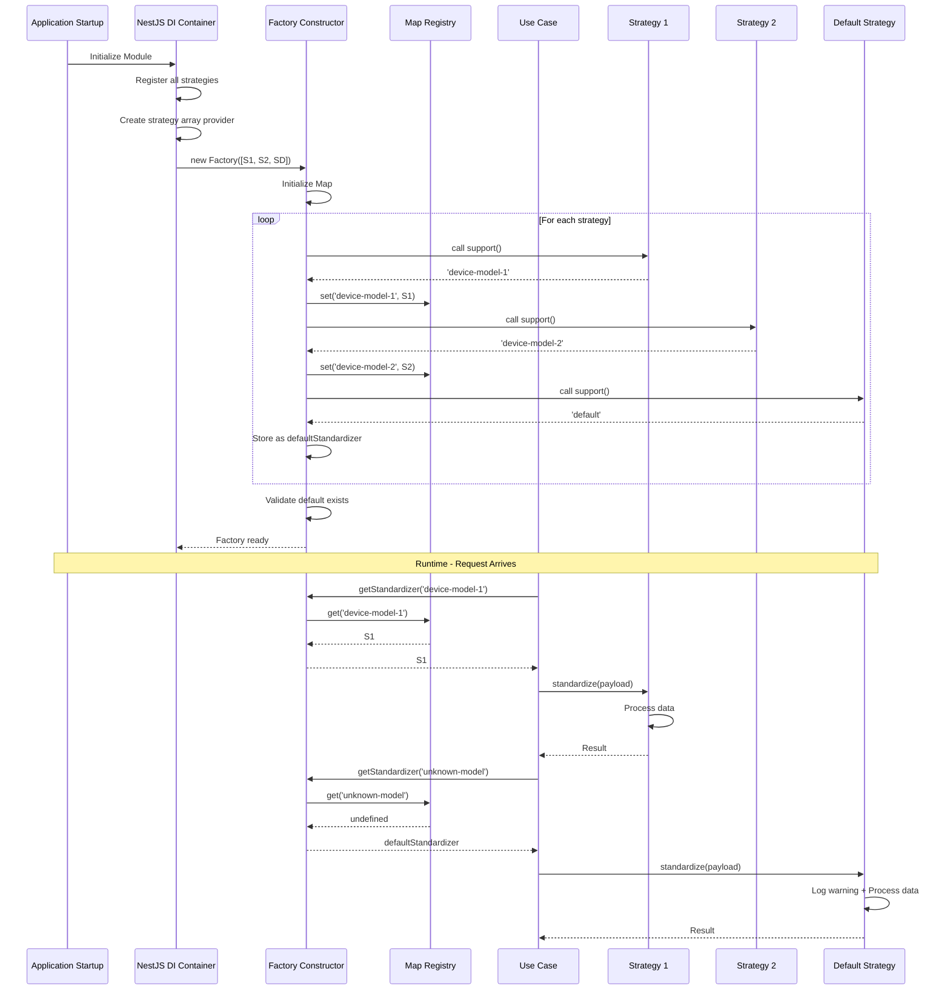

# Factory Pattern with Array Injection

> **Pattern:** Factory + Array Injection for dynamic strategy selection with O(1) lookup performance

## Overview

The Factory pattern with Array Injection enables dynamic selection of concrete implementations based on runtime data using NestJS dependency injection. This pattern provides type-safe strategy selection with O(1) lookup performance using Map-based registry, supports the Open-Closed Principle by allowing new implementations without factory modifications, and includes mandatory default fallback handling.

---

## When to Use This Pattern

### Use Cases

✅ **GOOD - Use this pattern when:**

- Multiple strategies/implementations exist for the same interface
- Strategy selection based on runtime data (device type, message format, etc.)
- Need O(1) lookup performance for strategy selection
- Want to add new strategies without modifying factory code (Open-Closed Principle)
- Require fallback/default strategy for unknown inputs
- All strategies are stateless or singleton-scoped

### Examples

```typescript
// ✅ GOOD - Device-specific data transformation
const standardizer = factory.getStandardizer(deviceModel);
const entities = standardizer.standardize(rawPayload);

// ✅ GOOD - Payment gateway selection
const gateway = factory.getPaymentGateway(paymentMethod);
await gateway.process(payment);

// ✅ GOOD - File parser selection
const parser = factory.getParser(fileExtension);
const data = parser.parse(fileContent);
```

❌ **BAD - Do NOT use this pattern when:**

- Only one or two implementations exist (unnecessary complexity)
- Strategy selection is static at compile time
- Implementations have complex lifecycles or dependencies
- Strategies need per-request instances (use prototype scope instead)

---

## Pattern Structure

### 1. Strategy Interface

**Purpose:** Defines contract for all implementations

**Location:** `src/modules/{module}/usecases/{strategy-type}/{strategy-name}.interface.ts`

**Example:** `src/modules/data-standardization/usecases/standardizers/device-data-standardizer.interface.ts`

```typescript
import { DeviceModelEnum } from 'src/shared/domain/enums';
import { StandardizedEntity } from 'src/shared/domain/types';
import { RawPayloadDto } from '../../dto/raw-device-event.dto';

/**
 * Type alias for raw device payload to improve readability in strategy implementations.
 */
export type RawDevicePayload = RawPayloadDto;

/**
 * Device data standardizer interface defining the contract for transforming
 * device-specific payloads into standardized entities.
 *
 * This interface enables the Factory pattern, allowing new device models
 * to be supported by implementing this contract without modifying existing code.
 *
 * Implementations must:
 * 1. Declare the device model(s) they support via support()
 * 2. Transform raw device payloads into standardized entities via standardize()
 *
 * @example
 * class LR01PulseStandardizer implements IDeviceDataStandardizer {
 *   support(): DeviceModelEnum {
 *     return DeviceModelEnum.LR01_PULSE;
 *   }
 *
 *   standardize(rawPayload: RawDevicePayload): StandardizedEntity[] {
 *     // Transform device-specific payload to standardized entities
 *     return [...entities];
 *   }
 * }
 */
export interface IDeviceDataStandardizer {
  /**
   * Returns the identifier this strategy supports.
   *
   * CRITICAL: Return 'default' for fallback strategy (exactly one required)
   *
   * @returns Strategy identifier or 'default' for fallback
   */
  support(): DeviceModelEnum | 'default';

  /**
   * Executes the strategy-specific logic.
   *
   * @param rawPayload - Input data
   * @returns Processed output
   */
  standardize(rawPayload: RawDevicePayload): StandardizedEntity[];
}
```

**Key Interface Requirements:**

| Requirement | Purpose | Example |
|-------------|---------|---------|
| **support() method** | Returns unique identifier | `DeviceModelEnum.LR01_PULSE` or `'default'` |
| **Process method** | Executes strategy logic | `standardize()`, `process()`, `parse()` |
| **Return type** | Consistent across all implementations | `StandardizedEntity[]` |
| **Default fallback** | Exactly one strategy returns `'default'` | Required for unknown inputs |

---

### 2. Factory Service

**Purpose:** Manages strategy registry and provides O(1) lookup

**Location:** `src/modules/{module}/usecases/{strategy-type}/{strategy-name}.factory.ts`

**Example:** `src/modules/data-standardization/usecases/standardizers/device-standardizer.factory.ts`

```typescript
import { Injectable, Inject } from '@nestjs/common';
import { IDeviceDataStandardizer } from './device-data-standardizer.interface';

/**
 * Injection token for strategy array (type-safe Symbol token).
 * Used for NestJS dependency injection with array injection pattern.
 * CRITICAL: Use Symbol, not string literal, for type safety
 */
export const DEVICE_STANDARDIZERS = Symbol('DEVICE_STANDARDIZERS');

/**
 * Factory for selecting device-specific standardizers using the Factory pattern.
 *
 * This factory provides O(1) lookup performance using a Map-based registry of standardizers.
 * Strategies are auto-discovered via NestJS dependency injection, enabling the
 * Open-Closed Principle: new device models can be added by creating new strategy
 * implementations without modifying this factory code.
 *
 * Performance characteristics:
 * - Map initialization: O(n) where n = number of strategies (constructor, one-time)
 * - Lookup operation: O(1) constant time
 * - Target: < 5ms (P95) for strategy selection
 *
 * @example
 * // In a use case
 * constructor(private factory: DeviceStandardizerFactory) {}
 *
 * execute(event: RawDeviceEventDto) {
 *   const standardizer = this.factory.getStandardizer(event.deviceModel);
 *   const entities = standardizer.standardize(event.payload);
 * }
 */
@Injectable()
export class DeviceStandardizerFactory {
  private readonly standardizers: Map<string, IDeviceDataStandardizer>;
  private readonly defaultStandardizer: IDeviceDataStandardizer;

  constructor(@Inject(DEVICE_STANDARDIZERS) standardizers: IDeviceDataStandardizer[]) {
    this.standardizers = new Map<string, IDeviceDataStandardizer>();

    let defaultFound: IDeviceDataStandardizer | undefined;

    // Step 1: Iterate through all strategies
    for (const standardizer of standardizers) {
      const deviceModel = standardizer.support();

      // Step 2: Separate default from specific strategies
      if (deviceModel === 'default') {
        defaultFound = standardizer;
      } else {
        // Step 3: Register specific strategies in Map
        this.standardizers.set(deviceModel, standardizer);
      }
    }

    // Step 4: Validate default strategy exists
    if (!defaultFound) {
      throw new Error('No default standardizer found. At least one standardizer must support "default".');
    }

    this.defaultStandardizer = defaultFound;
  }

  /**
   * Selects strategy for identifier with O(1) Map lookup.
   *
   * @param deviceModel - Strategy identifier
   * @returns Device-specific strategy or default fallback
   */
  getStandardizer(deviceModel: string): IDeviceDataStandardizer {
    return this.standardizers.get(deviceModel) || this.defaultStandardizer;
  }
}
```

**Factory Implementation Rules:**

| Component | Requirement | Why |
|-----------|-------------|-----|
| **Symbol Token** | Use `Symbol('TOKEN_NAME')` | Type safety, prevents collisions |
| **Map Registry** | `Map<string, Strategy>` | O(1) lookup performance |
| **Default Storage** | Separate field for default | Faster fallback, no Map lookup |
| **Constructor Validation** | Throw if no default found | Fail fast at startup |
| **Array Injection** | `@Inject(SYMBOL_TOKEN)` | NestJS array injection pattern |

---

### 3. Concrete Strategy Implementation

**Purpose:** Implements strategy interface for specific use case

**Location:** `src/modules/{module}/usecases/{strategy-type}/impl/{strategy-name}.ts`

**Example 1: Default Fallback Strategy**

`src/modules/data-standardization/usecases/standardizers/impl/default.standardizer.ts`

```typescript
import { Injectable, Logger } from '@nestjs/common';
import { DeviceModelEnum, EntityCategory } from 'src/shared/domain/enums';
import { StandardizedEntity } from 'src/shared/domain/types';
import { IDeviceDataStandardizer, RawDevicePayload } from '../device-data-standardizer.interface';

const DEVICE_MODEL = DeviceModelEnum.UNKNOWN;

/**
 * Fallback standardizer for unsupported device models with best-effort extraction
 *
 * BUSINESS DECISION: Logs WARNING when invoked to enable monitoring of unsupported devices
 *
 * CRITICAL: Exactly ONE strategy must return 'default' from support()
 */
@Injectable()
export class DefaultDeviceDataStandardizer implements IDeviceDataStandardizer {
  private readonly logger = new Logger(DefaultDeviceDataStandardizer.name);

  support(): 'default' {
    return 'default';
  }

  /**
   * Extracts entities using common extractors for unsupported device models
   * @param rawPayload - Unknown device payload requiring fallback extraction
   * @returns Extracted entities using best-effort strategy
   */
  standardize(rawPayload: RawDevicePayload): StandardizedEntity[] {
    this.logger.warn(`Using default standardizer for unknown device model - payload status: ${rawPayload.status}`);

    return [
      ...extractStatusEntity(rawPayload, DEVICE_MODEL),
      ...this.extractGenericValueEntity(rawPayload),
      ...extractBaseBatteryEntities(rawPayload, DEVICE_MODEL),
      ...extractAcStatusEntity(rawPayload, DEVICE_MODEL),
      ...extractErrorEntities(rawPayload, DEVICE_MODEL),
      ...extractAlertEntities(rawPayload, DEVICE_MODEL),
    ];
  }

  private extractGenericValueEntity(rawPayload: RawDevicePayload): StandardizedEntity[] {
    if (!isValidValue(rawPayload.value)) {
      return [];
    }

    return [
      {
        id: 'sensor.value',
        category: EntityCategory.SENSOR,
        class: SensorEntityClass.GENERIC,
        state: rawPayload.value,
        attributes: {
          unit_of_measurement: UnitOfMeasurement.NONE,
          state_class: StateClass.MEASUREMENT,
          friendly_name: 'Generic Sensor Value',
          icon: 'mdi:adjust',
        },
      },
    ];
  }
}
```

**Example 2: Specific Strategy**

`src/modules/data-standardization/usecases/standardizers/impl/lr01-pulse.standardizer.ts`

```typescript
import { Injectable } from '@nestjs/common';
import { DeviceModelEnum, EntityCategory } from 'src/shared/domain/enums';
import { StandardizedEntity } from 'src/shared/domain/types';
import { IDeviceDataStandardizer, RawDevicePayload } from '../device-data-standardizer.interface';

const DEVICE_MODEL = DeviceModelEnum.LR01_PULSE;

/**
 * Standardizer for LR01Pulse universal pulse counter
 */
@Injectable()
export class LR01PulseStandardizer implements IDeviceDataStandardizer {
  support(): DeviceModelEnum {
    return DeviceModelEnum.LR01_PULSE;
  }

  standardize(rawPayload: RawDevicePayload): StandardizedEntity[] {
    return [
      ...extractStatusEntity(rawPayload, DEVICE_MODEL),
      ...this.extractVolumeEntity(rawPayload),
      ...extractBaseBatteryEntities(rawPayload, DEVICE_MODEL),
      ...extractAcStatusEntity(rawPayload, DEVICE_MODEL),
      ...extractErrorEntities(rawPayload, DEVICE_MODEL),
      ...extractAlertEntities(rawPayload, DEVICE_MODEL),
    ];
  }

  private extractVolumeEntity(rawPayload: RawDevicePayload): StandardizedEntity[] {
    if (!isValidValue(rawPayload.value)) {
      return [];
    }

    return [
      {
        id: 'sensor.volume',
        category: EntityCategory.SENSOR,
        class: SensorEntityClass.VOLUME,
        state: rawPayload.value,
        attributes: {
          unit_of_measurement: UnitOfMeasurement.CUBIC_METER,
          state_class: StateClass.METER,
          friendly_name: 'Pulse Volume',
          icon: 'mdi:gauge',
        },
      },
    ];
  }
}
```

**Strategy Implementation Rules:**

| Rule | Requirement | Notes |
|------|-------------|-------|
| **@Injectable()** | ✅ Required | For NestJS DI |
| **implements Interface** | ✅ Required | Ensures contract compliance |
| **support() method** | ✅ Required | Must return unique identifier or `'default'` |
| **Exactly one default** | ✅ Required | One and only one strategy returns `'default'` |
| **Process method** | ✅ Required | Core strategy logic |
| **Stateless preferred** | ✅ Recommended | Easier to test and reason about |
| **Logging** | ⚠️ Optional | Log when default fallback used |

---

### 4. Provider Configuration (Array Injection Pattern)

**Purpose:** Wires all strategies to factory via NestJS DI

**Location:** `src/modules/{module}/usecases/{strategy-type}/index.ts`

**Example:** `src/modules/data-standardization/usecases/standardizers/index.ts`

```typescript
import { Provider } from '@nestjs/common';
import { DEVICE_STANDARDIZERS, DeviceStandardizerFactory } from './device-standardizer.factory';
import { IDeviceDataStandardizer } from './device-data-standardizer.interface';
import { DefaultDeviceDataStandardizer } from './impl/default.standardizer';
import { LR01PulseStandardizer } from './impl/lr01-pulse.standardizer';
import { LR013PulseStandardizer } from './impl/lr01-3pulse.standardizer';
import { LR01ABBAquaMaster4Standardizer } from './impl/lr01-abba-aqua-master4.standardizer';
// ... more imports

/**
 * Array of all strategy implementations
 * CRITICAL: Must include exactly ONE default strategy
 */
const DeviceStandardizerImpls = [
  DefaultDeviceDataStandardizer,      // ✅ Default fallback
  LR01ABBAquaMaster4Standardizer,
  LR01PulseStandardizer,
  LR013PulseStandardizer,
  // ... more strategies
];

/**
 * Providers array for NestJS dependency injection with array injection pattern.
 * Add new standardizers to DeviceStandardizerImpls array above.
 *
 * Pattern Explanation:
 * 1. Register factory as provider
 * 2. Register all strategy implementations
 * 3. Create array provider using useFactory + inject pattern
 *
 * @example
 * @Module({
 *   providers: [...DeviceStandardizerProviders],
 *   exports: [DeviceStandardizerFactory],
 * })
 */
export const DeviceStandardizerProviders: Provider[] = [
  DeviceStandardizerFactory,
  ...DeviceStandardizerImpls,
  {
    provide: DEVICE_STANDARDIZERS,
    useFactory: (...standardizers: IDeviceDataStandardizer[]) => standardizers,
    inject: DeviceStandardizerImpls,
  },
];

// Re-export public API
export { IDeviceDataStandardizer, RawDevicePayload } from './device-data-standardizer.interface';
export { DeviceStandardizerFactory } from './device-standardizer.factory';
export { DefaultDeviceDataStandardizer } from './impl/default.standardizer';
export { LR01PulseStandardizer } from './impl/lr01-pulse.standardizer';
// ... more re-exports
```

**Array Injection Pattern Breakdown:**

```typescript
{
  provide: DEVICE_STANDARDIZERS,                                    // 1. Symbol token
  useFactory: (...standardizers: IDeviceDataStandardizer[]) =>      // 2. Factory function
    standardizers,                                                   // 3. Returns array
  inject: DeviceStandardizerImpls,                                  // 4. Injects all strategies
}
```

**How It Works:**

1. **provide:** Symbol token for injection
2. **useFactory:** Factory function that receives all strategies
3. **inject:** Array of strategy classes to inject
4. **Result:** Factory receives array of all strategy instances

**Provider Configuration Rules:**

| Component | Requirement | Purpose |
|-----------|-------------|---------|
| **Factory Provider** | Include in providers array | Makes factory injectable |
| **Strategy Providers** | Spread all implementations | Makes strategies available for DI |
| **Array Provider** | Symbol token + useFactory + inject | Creates injected array |
| **Symbol Token** | Use Symbol, not string | Type safety |
| **Exactly one default** | Validate in DeviceStandardizerImpls | Required for fallback |

---

### 5. Module Registration

**Purpose:** Register providers in NestJS module

**Location:** `src/modules/{module}/{module}.module.ts`

**Example:** `src/modules/data-standardization/data-standardization.module.ts`

```typescript
import { Module } from '@nestjs/common';
import { DataStandardizationController } from './data-standardization.controller';
import { StandardizeDeviceDataUseCase } from './usecases/standardize-device-data.usecase';
import { DeviceStandardizerProviders, DeviceStandardizerFactory } from './usecases/standardizers';

/**
 * Data Standardization Module
 * Handles device event consumption and standardization
 *
 * Standardization (Factory Pattern):
 * - DeviceStandardizerFactory + Providers: Transforms device-specific payloads
 * - Uses NestJS DI with array injection pattern
 * - Fallback: model-specific → default
 */
@Module({
  controllers: [DataStandardizationController],
  providers: [
    StandardizeDeviceDataUseCase,

    // Factory Pattern Providers (Array Injection Pattern)
    ...DeviceStandardizerProviders,
  ],
  exports: [DeviceStandardizerFactory],  // Export factory for other modules
})
export class DataStandardizationModule {}
```

**Module Registration Rules:**

| Component | Registration | Purpose |
|-----------|-------------|---------|
| **Providers** | Spread strategy providers | `...DeviceStandardizerProviders` |
| **Exports** | Export factory if needed | Makes factory available to other modules |
| **Controllers** | Register as normal | Standard NestJS pattern |
| **Use Cases** | Register as normal | Can inject factory |

---

## Complete Flow Diagram



---

## Testing Strategy

### 1. Factory Constructor Tests

**Test factory initialization and Map building**

**Location:** `src/modules/{module}/usecases/{strategy-type}/{strategy-name}.factory.spec.ts`

```typescript
import { Test, TestingModule } from '@nestjs/testing';
import { DeviceStandardizerFactory, DEVICE_STANDARDIZERS } from './device-standardizer.factory';
import { IDeviceDataStandardizer } from './device-data-standardizer.interface';
import { DeviceModelEnum } from 'src/shared/domain/enums';

describe('DeviceStandardizerFactory', () => {
  let target: DeviceStandardizerFactory;

  describe('constructor and Map initialization', () => {
    it('should initialize Map with device-specific standardizers', () => {
      // Arrange
      const mockStandardizerA: IDeviceDataStandardizer = {
        support: () => DeviceModelEnum.LR01_PULSE,
        standardize: (payload) => [],
      };
      const mockStandardizerB: IDeviceDataStandardizer = {
        support: () => DeviceModelEnum.LR01_3PULSE,
        standardize: (payload) => [],
      };
      const mockDefaultStandardizer: IDeviceDataStandardizer = {
        support: () => 'default',
        standardize: (payload) => [],
      };

      // Act
      target = new DeviceStandardizerFactory([
        mockStandardizerA,
        mockStandardizerB,
        mockDefaultStandardizer,
      ]);

      // Assert
      expect(target.getStandardizer(DeviceModelEnum.LR01_PULSE)).toBe(mockStandardizerA);
      expect(target.getStandardizer(DeviceModelEnum.LR01_3PULSE)).toBe(mockStandardizerB);
    });

    it('should identify and store default standardizer', () => {
      // Arrange
      const mockStandardizer: IDeviceDataStandardizer = {
        support: () => DeviceModelEnum.LR01_PULSE,
        standardize: (payload) => [],
      };
      const mockDefaultStandardizer: IDeviceDataStandardizer = {
        support: () => 'default',
        standardize: (payload) => [],
      };

      // Act
      target = new DeviceStandardizerFactory([
        mockStandardizer,
        mockDefaultStandardizer,
      ]);

      // Assert
      expect(target.getStandardizer('UnknownModel')).toBe(mockDefaultStandardizer);
    });

    it('should throw error if no default standardizer provided', () => {
      // Arrange
      const mockStandardizer: IDeviceDataStandardizer = {
        support: () => DeviceModelEnum.LR01_PULSE,
        standardize: (payload) => [],
      };

      // Act & Assert
      expect(() => new DeviceStandardizerFactory([mockStandardizer])).toThrow(
        'No default standardizer found. At least one standardizer must support "default".',
      );
    });
  });

  describe('getStandardizer', () => {
    beforeEach(() => {
      const mockStandardizerA: IDeviceDataStandardizer = {
        support: () => DeviceModelEnum.LR01_PULSE,
        standardize: (payload) => [
          {
            id: 'sensor.volume',
            category: EntityCategory.SENSOR,
            class: SensorEntityClass.VOLUME,
            state: 123,
            attributes: {
              state_class: StateClass.METER,
              unit_of_measurement: UnitOfMeasurement.CUBIC_METER,
              friendly_name: 'Pulse Volume',
            },
          },
        ],
      };
      const mockDefaultStandardizer: IDeviceDataStandardizer = {
        support: () => 'default',
        standardize: (payload) => [],
      };

      target = new DeviceStandardizerFactory([
        mockStandardizerA,
        mockDefaultStandardizer,
      ]);
    });

    it('should return correct standardizer for known device model (O(1) lookup)', () => {
      // Act
      const result = target.getStandardizer(DeviceModelEnum.LR01_PULSE);

      // Assert
      expect(result).toBeDefined();
      expect(result.support()).toBe(DeviceModelEnum.LR01_PULSE);
    });

    it('should return default standardizer for unknown device model', () => {
      // Act
      const result = target.getStandardizer('UnknownDeviceModel');

      // Assert
      expect(result).toBeDefined();
      expect(result.support()).toBe('default');
    });

    it('should handle empty string device model', () => {
      // Act
      const result = target.getStandardizer('');

      // Assert
      expect(result).toBeDefined();
      expect(result.support()).toBe('default');
    });
  });

  describe('NestJS DI integration', () => {
    it('should be injectable via NestJS DI with Symbol token', async () => {
      // Arrange
      const mockDefaultStandardizer: IDeviceDataStandardizer = {
        support: () => 'default',
        standardize: (payload) => [],
      };

      const module: TestingModule = await Test.createTestingModule({
        providers: [
          DeviceStandardizerFactory,
          {
            provide: DEVICE_STANDARDIZERS,
            useValue: [mockDefaultStandardizer],
          },
        ],
      })
        .setLogger(new MockLoggerService())
        .compile();

      // Act
      target = module.get<DeviceStandardizerFactory>(DeviceStandardizerFactory);

      // Assert
      expect(target).toBeDefined();
      expect(target.getStandardizer('AnyModel')).toBe(mockDefaultStandardizer);
    });
  });
});
```

**Test Coverage:**

- ✅ Map initialization with multiple strategies
- ✅ Default strategy identification
- ✅ Error when no default strategy
- ✅ O(1) lookup for known models
- ✅ Default fallback for unknown models
- ✅ Edge cases (empty string, null)
- ✅ NestJS DI integration

---

### 2. Strategy Implementation Tests

**Test each concrete strategy independently**

```typescript
describe('LR01PulseStandardizer', () => {
  let target: LR01PulseStandardizer;

  beforeEach(() => {
    target = new LR01PulseStandardizer();
  });

  it('should support LR01_PULSE device model', () => {
    expect(target.support()).toBe(DeviceModelEnum.LR01_PULSE);
  });

  it('should standardize volume entity from valid payload', () => {
    // Arrange
    const rawPayload: RawDevicePayload = {
      value: 123.45,
      status: 'ok',
      timestamp: '2025-01-01T00:00:00Z',
    };

    // Act
    const result = target.standardize(rawPayload);

    // Assert
    const volumeEntity = result.find((e) => e.id === 'sensor.volume');
    expect(volumeEntity).toBeDefined();
    expect(volumeEntity.state).toBe(123.45);
    expect(volumeEntity.attributes.unit_of_measurement).toBe(UnitOfMeasurement.CUBIC_METER);
  });

  it('should skip volume entity when value is null', () => {
    // Arrange
    const rawPayload: RawDevicePayload = {
      value: null,
      status: 'ok',
      timestamp: '2025-01-01T00:00:00Z',
    };

    // Act
    const result = target.standardize(rawPayload);

    // Assert
    const volumeEntity = result.find((e) => e.id === 'sensor.volume');
    expect(volumeEntity).toBeUndefined();
  });
});
```

---

## Common Pitfalls and Solutions

### Pitfall 1: No Default Strategy

**Problem:**

```typescript
// ❌ BAD - No strategy returns 'default'
const strategies = [
  new LR01PulseStandardizer(),    // Returns DeviceModelEnum.LR01_PULSE
  new LR013PulseStandardizer(),   // Returns DeviceModelEnum.LR01_3PULSE
  // Missing default!
];
```

**Impact:** Factory throws error at startup

**Solution:**

```typescript
// ✅ GOOD - Include default strategy
const strategies = [
  new DefaultDeviceDataStandardizer(),  // Returns 'default'
  new LR01PulseStandardizer(),
  new LR013PulseStandardizer(),
];
```

---

### Pitfall 2: Multiple Default Strategies

**Problem:**

```typescript
// ❌ BAD - Two strategies return 'default'
class DefaultStandardizerA implements IDeviceDataStandardizer {
  support(): 'default' { return 'default'; }
}

class DefaultStandardizerB implements IDeviceDataStandardizer {
  support(): 'default' { return 'default'; }
}
```

**Impact:** Last one wins, first default ignored

**Solution:**

- Have exactly ONE strategy return `'default'`
- Add validation test to ensure only one default exists

---

### Pitfall 3: Using String Token Instead of Symbol

**Problem:**

```typescript
// ❌ BAD - String token can collide
export const DEVICE_STANDARDIZERS = 'DEVICE_STANDARDIZERS';

constructor(@Inject(DEVICE_STANDARDIZERS) standardizers: IDeviceDataStandardizer[]) {}
```

**Impact:** Potential token collision with other modules

**Solution:**

```typescript
// ✅ GOOD - Symbol token is unique
export const DEVICE_STANDARDIZERS = Symbol('DEVICE_STANDARDIZERS');

constructor(@Inject(DEVICE_STANDARDIZERS) standardizers: IDeviceDataStandardizer[]) {}
```

---

### Pitfall 4: Forgetting to Spread Providers

**Problem:**

```typescript
// ❌ BAD - Providers not spread
@Module({
  providers: [
    DeviceStandardizerProviders,  // Wrong! This is an array
  ],
})
```

**Impact:** NestJS doesn't register providers correctly

**Solution:**

```typescript
// ✅ GOOD - Spread the providers array
@Module({
  providers: [
    ...DeviceStandardizerProviders,  // Correct!
  ],
})
```

---

### Pitfall 5: Duplicate support() Return Values

**Problem:**

```typescript
// ❌ BAD - Two strategies return same identifier
class StrategyA implements IDeviceDataStandardizer {
  support() { return DeviceModelEnum.LR01_PULSE; }
}

class StrategyB implements IDeviceDataStandardizer {
  support() { return DeviceModelEnum.LR01_PULSE; }  // Duplicate!
}
```

**Impact:** Last one wins, first strategy never used

**Solution:**

- Ensure unique identifiers for each strategy
- Add validation test to check for duplicates
- Use enum for identifiers to prevent typos

---

## Benefits of This Pattern

| Benefit | Description |
|---------|-------------|
| **Open-Closed Principle** | Add new strategies without modifying factory |
| **O(1) Lookup** | Map-based registry for constant-time lookup |
| **Type Safety** | Interface contract enforced by TypeScript |
| **Default Fallback** | Graceful handling of unknown inputs |
| **Testability** | Factory and strategies testable independently |
| **Discoverability** | NestJS DI auto-wires all strategies |
| **Performance** | < 5ms P95 for strategy selection |

---

## File Structure Summary

```
src/modules/{module}/
├── usecases/
│   └── {strategy-type}/                              # e.g., standardizers/
│       ├── {strategy-name}.interface.ts              # Strategy contract
│       ├── {strategy-name}.factory.ts                # Factory service
│       ├── {strategy-name}.factory.spec.ts           # Factory tests
│       ├── index.ts                                  # ✅ Providers array + exports
│       └── impl/
│           ├── default.standardizer.ts               # ✅ Required default
│           ├── default.standardizer.spec.ts
│           ├── {strategy-1}.standardizer.ts
│           ├── {strategy-1}.standardizer.spec.ts
│           ├── {strategy-2}.standardizer.ts
│           ├── {strategy-2}.standardizer.spec.ts
│           └── ...
└── {module}.module.ts                                # Module registration

**Real-World Example:**

src/modules/data-standardization/
├── usecases/
│   └── standardizers/
│       ├── device-data-standardizer.interface.ts
│       ├── device-standardizer.factory.ts
│       ├── device-standardizer.factory.spec.ts
│       ├── index.ts                                  # DeviceStandardizerProviders
│       └── impl/
│           ├── default.standardizer.ts               # Returns 'default'
│           ├── default.standardizer.spec.ts
│           ├── lr01-pulse.standardizer.ts
│           ├── lr01-pulse.standardizer.spec.ts
│           ├── lr01-3pulse.standardizer.ts
│           ├── lr01-3pulse.standardizer.spec.ts
│           └── ... (12 total strategies)
└── data-standardization.module.ts
```

---

## Quick Checklist

### Creating a New Strategy

- [ ] Implement strategy interface
- [ ] Add `@Injectable()` decorator
- [ ] Implement `support()` with unique identifier
- [ ] Implement process method (e.g., `standardize()`)
- [ ] Add to `{Strategy}Impls` array in `index.ts`
- [ ] Write unit tests for strategy logic
- [ ] Verify factory selects strategy correctly

### Creating Factory Pattern

- [ ] Create strategy interface with `support()` method
- [ ] Create Symbol token for array injection
- [ ] Create factory with Map-based registry
- [ ] Validate exactly one default strategy in constructor
- [ ] Create default strategy returning `'default'`
- [ ] Create providers array in `index.ts`
- [ ] Use array injection pattern (`useFactory` + `inject`)
- [ ] Spread providers in module
- [ ] Export factory if needed by other modules
- [ ] Write factory tests (initialization, lookup, default, DI)

### Testing

- [ ] Test factory initialization with multiple strategies
- [ ] Test default strategy identification
- [ ] Test error when no default strategy
- [ ] Test O(1) lookup for known identifiers
- [ ] Test default fallback for unknown identifiers
- [ ] Test edge cases (empty string, null, undefined)
- [ ] Test NestJS DI integration
- [ ] Test each strategy implementation independently
- [ ] Test no duplicate support() values

---

## Related Patterns

| Pattern | Relationship | When to Use Instead |
|---------|-------------|---------------------|
| **Strategy Pattern** | Factory selects strategies | Same use case, factory adds auto-discovery |
| **Abstract Factory** | Creates families of objects | Need to create multiple related objects |
| **Factory Method** | Subclasses decide creation | Subclass controls object creation |
| **Registry Pattern** | Map-based lookup | Similar, but factory adds default fallback |

---

## Performance Considerations

| Operation | Complexity | Target |
|-----------|-----------|--------|
| **Factory Initialization** | O(n) | One-time at startup |
| **Map Lookup** | O(1) | < 5ms P95 |
| **Default Fallback** | O(1) | Direct field access |
| **Strategy Execution** | Varies | Depends on strategy logic |

**Performance Best Practices:**

- ✅ Use Map for O(1) lookup (not array.find())
- ✅ Store default in separate field (no Map lookup)
- ✅ Initialize Map in constructor (one-time cost)
- ✅ Use Symbol token for type safety
- ✅ Keep strategies stateless (singleton scope)

---

## References

- [Factory Pattern](https://refactoring.guru/design-patterns/factory-method)
- [Strategy Pattern](https://refactoring.guru/design-patterns/strategy)
- [NestJS Custom Providers](https://docs.nestjs.com/fundamentals/custom-providers)
- [NestJS Dependency Injection](https://docs.nestjs.com/providers)

---

**Last Updated:** 2025-12-25
**Document Status:** ✅ Active
**Next Review:** 2026-01-25
